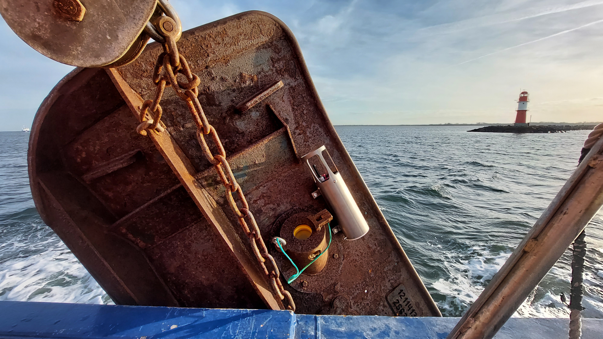
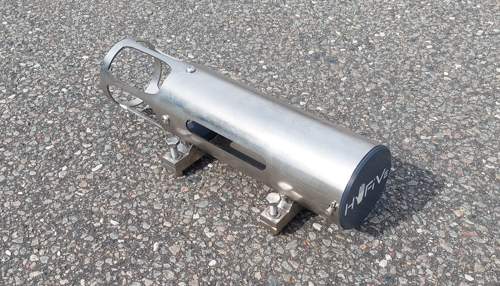
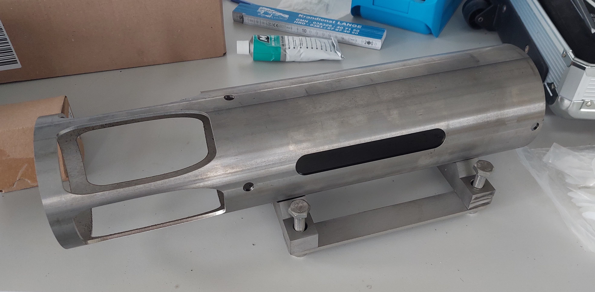
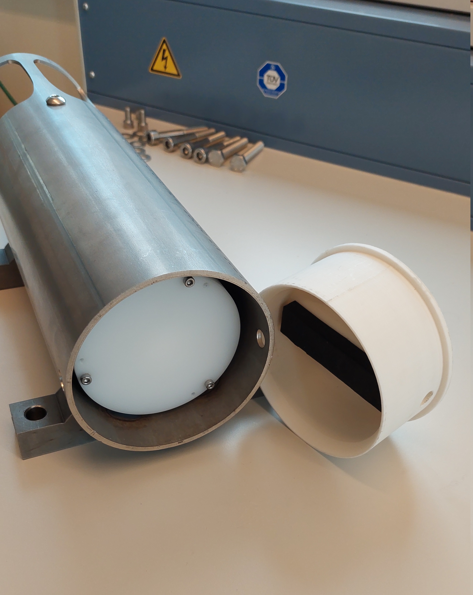

# Logger Mechanics: Otter board mounting
The logger can be deployed on a trawl. For this, the logger is attached to an otter board. Otter boards are big steel plates, which spread out the trawl. In order to mount and protect the logger on the otter board, we designed a mounting. 

<figure> 
   

   <figurecaption><a name="figure1">*Figure 1:*</a> *Otter board mounting deployed*</figurecaption>
</figure>

## Design 
During design the general requirements were:
-	Small/compact, not over 10 kg
-	Strong protection for logger
-	Good water flow to sensors, low interference of cage to water flow
-	Easy to install
-	Easy access to logger for vessel crew
-	Robust design of screws and joints, as few parts as possible
-	Cheap and easy production

After comparing several variants, we decided to manufacture the mounting from a steel tube, which accommodates the logger. The steel tube is edited in several ways:
- Windows are water-cut in one end of the tube. These windows are forming a cage, allowing a relatively free water flow to the sensors combined with a good protection. 
- Two feet are welded to the pipe in order to screw it to the otter board
- 3D printed inlays are inserted in the pipe. The inlays take up the logger, so it is fixed in position without touching steel.

The back inlay can be removed to insert or extract the logger. The back inlay is locked with a single bolt, which is secured with a splint. In this way we avoid a screw and are close to the usual tools of fishermen.  

- <figure>
   
   
   
   <figurecaption><a name="figure2">*Figure 2:*</a> *Otter board mounting with inserted 3D printed inlays; front inlay secured with screws (left) and back inlay secured with bolt and split pin (right)*</figurecaption>
 </figure>

- <figure>
   
   
   
   <figurecaption><a name="figure3">*Figure 3:*</a> *Details of otter board mounting: Welding stencil to ensure interchangeability of more than one mounting (left) and back inlay opened to access logger (right)*</figurecaption>
 </figure>

## Bill of Material
| #  | Amount | Name                                                  |
| -- | ------ | ----------------------------------------------------- |
| 1  | 1      | Mounting - Pipe, water-cut, according to drawing      |
| 2  | 2      | Mounting - Feet, water-cut, according to drawing      |
| 3  | 1      | Stencil for welding, water cut, according to drawing  |
| 4  | 1      | Stencil for drilling, water cut, according to drawing |
| 5  | 1      | Inlay front, 3D printed                               |
| 6  | 1      | Inlay back, 3D printed                                |
| 7  | 2      | Rubber mat, 3D printed (TPU)                          |
| 8  | 1      | Bolt, stainless A4, according to drawing              |
| 9  | 2      | Securing pin for bolt, 3.2x20 mm, stainless A4        |
| 10 | 4      | Screw, M10x50, stainless A4                           |
| 11 | 4      | Screw, M10x70, stainless A4                           |
| 12 | 3      | Screw, M8x8, stainless A4, hex, pan head (ISO 7380-1)                             |
| 13 | 4      | Washer M10, stainless A4                              |
| 14 | 4      | Washer M10 small, stainless A4                        |
| 15 | 6      | Nut M10, stainless A4, self-securing                  |
| 16 | 1      | Self-gluing foam 80x15x10 mm                          |

## Manufacturing
To manufacture one otter board mounting, these steps need to be taken: 
1. Water-cut the following parts according to the published drawings and step files. There are many companies offering water-cutting, but rotating the pipe while cutting is not a standard job, so you might need some time researching manufactures in your area. 
    - Water-cut pipe
    - Water-cut feet from 25 mm steel plate
    - Water-cut stencil for welding
    - Water-cut stencil for drilling into otter board
2. Attach feet to pipe by welding according to drawing. If you manufacture more than one mounting, it is recommended to use the stencils. They ensure that the distances between bore holes are always the same and that you can exchange the mountings on board. The welding stencil is screw on the feets before welding welding them on the pipe.The drilling stencil is used, when drilling into the otter boards. 
3. Manufacture bolt, which locks back inlay, according to drawing
4. 3D print back and front inlay as well as rubber mats
5. Cut M8 threads into front inlay, screw front inlay to pipe
6. Glue foam into end cap. This foam works as spring, fixing the position of the logger.
7. Insert back inlay, lock with bolt and splint.

