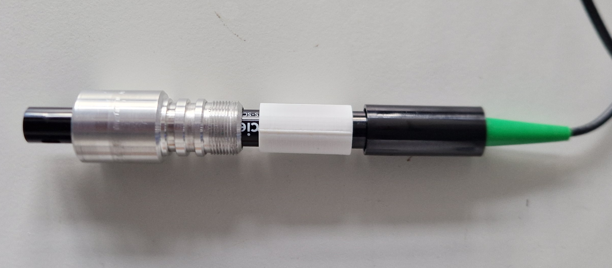
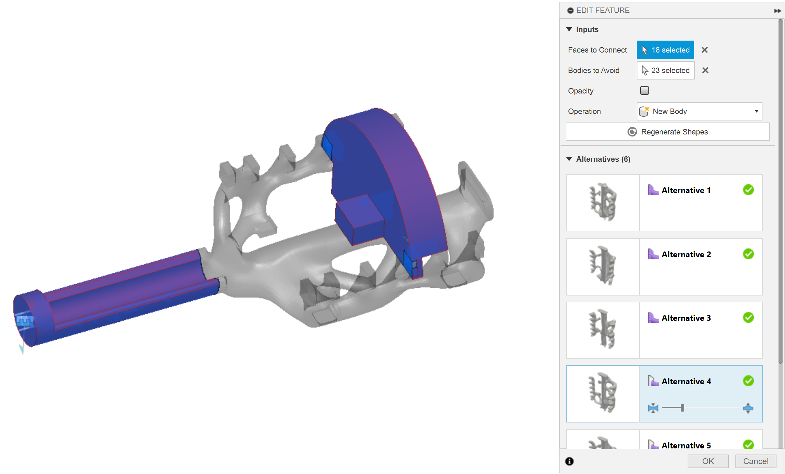
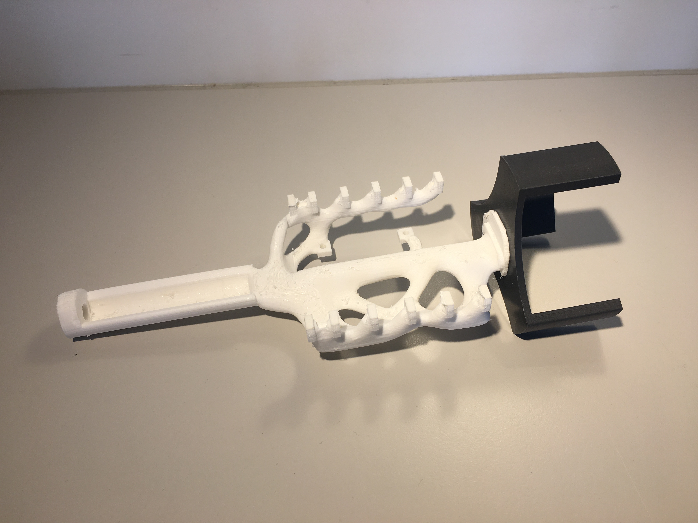
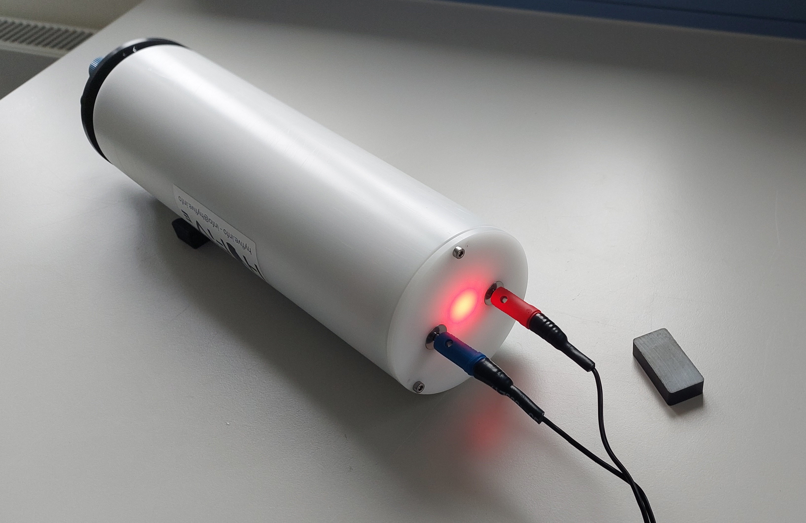

# Mechanical Hardware of the HyFiVe Logger

This readme explains considerations during mechanical design and is aimed to enable the reader to reproduce or modify the hardware.

Software: The mechanical hardware was designed in the CAD software Fusion 360 from Autodesk (version 2.0.19725). All design files were exported in the .f3d file format of this software as well as the commonly used .step exchange format. 

## Pressure Housing

### General Form
The electronic components of the logger are protected by a resealable pressure housing. A cylinder with flat end caps was chosen as basic form for this housing, because it is easy to manufacture and hydrostatically favourable. The dimensions of the cylinder was chosen according to the fitted components:
- Inner diameter            = 76 mm
- Length without end caps   = 275 mm   

The room inside the cylinder is divided in three sections, which are used by the following components:
1. Sensors (approx. 100 mm length)
2. Electronics (approx. 75 mm length)
3. Batteries (approx. 65 mm length)

<figure> 
   

   <figurecaption><a name="figure1">*Figure 1:*</a> *The room inside the logger is devided into three sections: Battery, electronics and sensors*</figurecaption>
</figure>

### Material Choice
As material of the pressure housing we compared different metal and plastic materials. We decided for plastic material, because it is lightweigt, easy to process and facilitates wireless charging as well as data transmission. As specific material we chose Polyoxymethylene (POM), since it is affordable, widely used and offers relatively good mechanical strength. 

### Calculation of Wall Thickness
The requirements for the logger contained a depth rating of 300 m. The thickness of the pressure housing was designed according to [Technical Memorandum 3-81, Woods Hole Oceanographic Institution, 1981](https://darchive.mblwhoilibrary.org/server/api/core/bitstreams/3d9f97f5-31f3-5559-85ba-1ef265a84cb4/content). The corresponding calculation is published as Excel file. 

### Sealing
For sealing the pressure housing O-rings were chosen. All connections are sealed with two O-rings, except third party products with only one inbuilt O-ring. The O-ring grooves were designed according to the [technical guide of Norelem](https://norelem.de/medias/23900-Technischer-Hinweis-O-Ringe-DE.pdf?context=bWFzdGVyfHJvb3R8MzEzNjczfGFwcGxpY2F0aW9uL3BkZnxhR1kxTDJnNE5TODVNREUxTlRJNU16Y3pOekkyTHpJek9UQXdYMVJsWTJodWFYTmphR1Z5WDBocGJuZGxhWE5mVHkxU2FXNW5aVjlFUlM1d1pHWXxkZTcyN2ZmN2VkMjcwYTA5M2RjNzFkNjc0MjMxYTQxZWMxMjZkMTQxMmRlNGU0YTVjOTY2ZThiNTI4NGNmNDE5). In favour of easy maintenance, we decided against 'pressure neutral' designs, e.g. by filling with oil or potting with resin.

The end caps are sealed with two radial O-rings of 3 mm diameter. The end caps are attached to the cylinder by three M3x16 mm screws in axial direction, to prevent accidental removal. 

## Penetrators

### Use of End Caps
The flat end caps are used to feed through sensors and other components, which need contact with the environment. The sensors are placed on one end cap, which offers space for up to six sensors. The sensors are positioned in a ring, where the centre position can't be used, as it is occupied by the electronic mounting inside. The second end cap is used for additional functionalities e.g. charging contacts, an LED and a magnetic switch. Two types of drawings are given for manufacturing: One drawing for a blank end cap and other drawings for postprocessing the specific drillings needed on both end caps. 

### Self-Designed Bushings for Sensors Without In-Built Sealings
Most of the used OEM-sensors provide an inbuilt sealing and a thread for securing. But some sensors - like the conductivity sensors from Atlas Scientific, which is designed for lab-use - do not offer an inbuilt sealing. For this type of sensors we developed a metal bushing, which is manufactured on a lathe. The bushing provides two grooves for radial O-rings, a thread to secure against accidental removal and a chamber, which is filled with Epoxy resin and seals the bushing towards the sensor shaft (this processed is described under ../04_Sensors)
<figure> 
   

   <figurecaption><a name="figure2">*Figure 2:*</a> *Self designed bushing to feed lab sensors through the pressure housing*</figurecaption>
</figure>

### Pressure valve
A pressure relief valve is integrated for several reasons. The valve is opened while closing the cylinder, in this way you do not compress the air. It is also used to perform a vacuum test after assembly. You could also use it to refill the vacuum with nitrogen to avoid condensation. We used the pressure relief valve from BlueRobotics, as they offer a corresponding pump and the valve is affordable and relatively small. 

## Electronic Mountings
3D printed mountings were developed to hold the electronic components inside the logger. The mounting is attached to the same end cap the sensors are fed through. In this way all electronic components and most cables can be extracted on one side of the logger. The mounting is attached with a single screw in the centre of the cap, please see Figure 1.

Manually designing mounting, that connects more than two components in a three-dimensional room, can be a tiring and error prone job, especially if the position of the components is changing during development. To facilitate the design process, the generative design function of Fusion 360 was used. After defining surfaces, which shall be connected, and volumes, which are blocked, the software proposes different solutions. The results are organic looking, tree-like bodies, which can be easily adapted by changing the input and recalculation. 
<figure>
   
   
   
   <figurecaption><a name="figure3">*Figure 3:*</a> *Mounting for electronics inside logger - modeled with generative modeling in Fusion 360 (left) and 3D printed (right) (the shown mounting is for the modular logger)*</figurecaption>
 </figure>

## Self-Designed Penetrators for Charging and Integration of LED and Magnetic Sensor
These features are only available for the modular logger and descriped under [01_Logger/02_Modular_Logger/02_Mechanics/](../../02_Modular_Logger/02_Mechanics/README.md).

<figure> 
   

   <figurecaption><a name="figure4">*Figure 4:*</a> *Modular logger with charging contacts, LED and magnetic switch. For detailed description look there.*</figurecaption>
</figure>

## Otter board mounting
The logger can be deployed on a trawl. For this use case we developed an own mounting, which is described in the folder in [./04_otter_board_mounting](./04_otter_board_mounting/readme.md). 
<figure> 
   

   <figurecaption><a name="figure5">*Figure 5:*</a> *Self designed mounting to attach logger to an otter board of a trawl net*</figurecaption>
</figure>

## Bill of Material
The following mechanical material is needed to build a basic logger (in addition to the PCBs and electrical components).

| #  | Amount | Name                                                                  |
| -- | ------ | --------------------------------------------------------------------- |
|    |        | **Pressure cylinder**                                                     |
| 1  | 1      | Cylinder, POM, D 76/90, L 275, according to drawing                   |
| 2  | 1      | End cap for sensors, according to drawing                             |
| 3  | 1      | End cap, blank                                                        |
| 4  | 6      | Screws M3 x 14, hexagonal, stainless A4                               |
| 5  | 4      | O-ring 70 x 3, NBR70                                                  |
| 6  | 1      | O-ring lube, e.g. Molycote 44 Medium                                  |
|    |        | **Internal mounting**                                                     |
| 7  | 1      | Mounting for electronic components, 3D printed                        |
| 8  | 1      | Mounting for battery pack, 3D printed                                 |
| 9  | 3      | Tapping screw, M2.9 x 9.5, for attaching main PCB                     |
| 10 | 1      | Screws M6 x 14, hexagonal                                             |
|    |        | **Sensors and accessories**                                               |
| 11 | 1      | Temperature: BlueRobotics Celsius Fast Responde, incl. O-ring and nut |
| 12 | 1      | Pressure: Keller 20D, 50bar, incl. adapter PCB                        |
| 13 | 1      | Oxygen: Pyroscience picoO2sub incl. Oxycap-sub, O-ring and nut        |
| 14 | 1      | Conductivity: Atlas Scientific K1.0 incl. adapter board               |
| 15 | 1      | Bushing for conductivity sensor, incl. distance sleeve for potting    |
| 16 | 1      | Nut M18x1 ('Sechskant-Gegenmutter')                                   |
| 17 | 2      | O-ring, 15.5 x 2, NBR70                                               |
| 18 | 1      | Pressure valve, BlueRobotics PRV-R1, incl. O-rings and nut            |
| 19 | 1      | Vacuum pump, BlueRobotics Vacuum-Pump-R1, incl. adapter for PRV       |