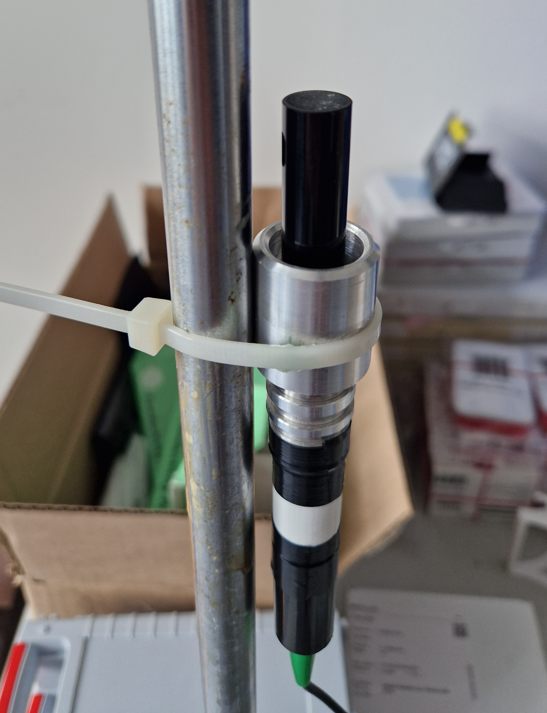
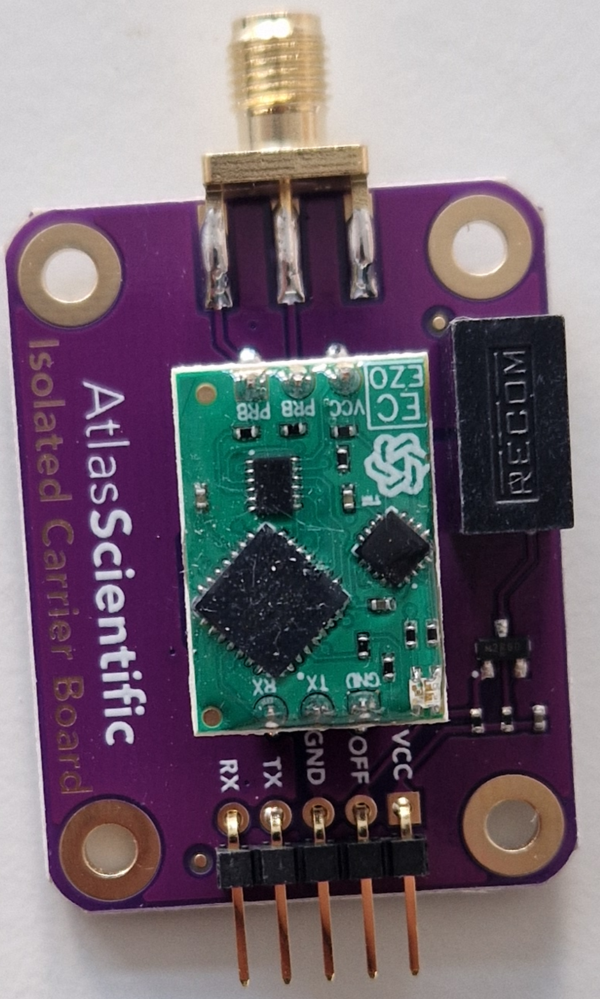
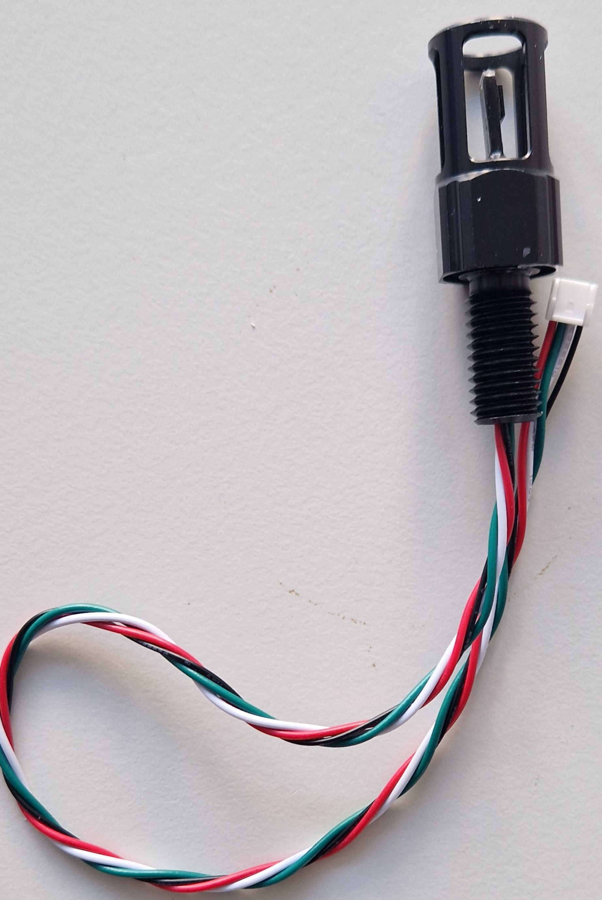
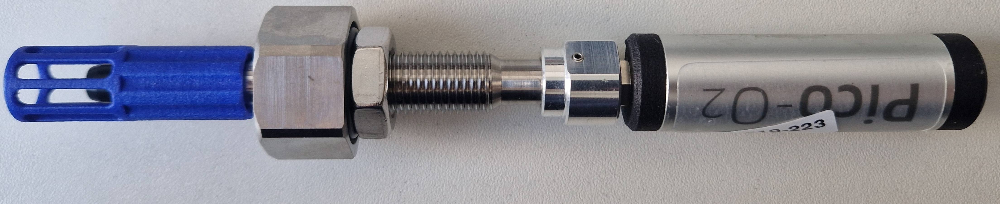
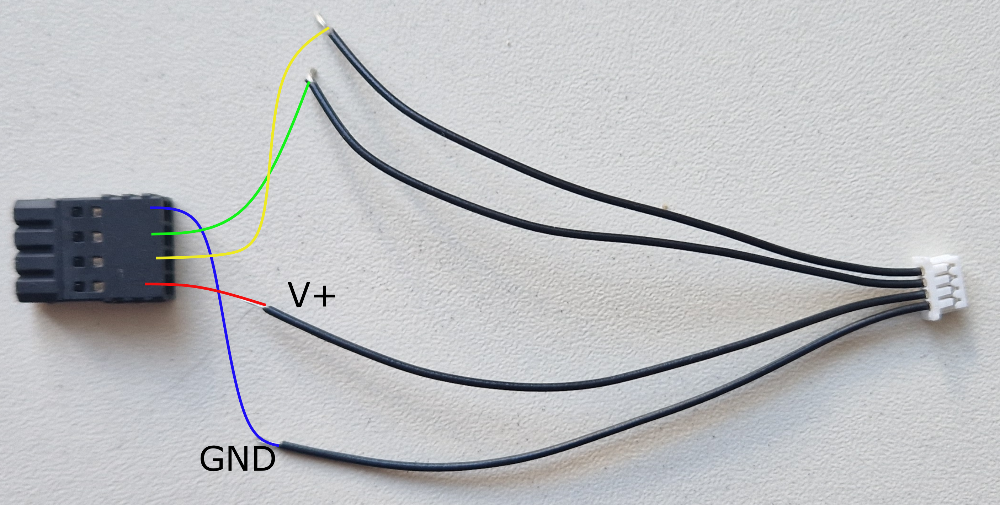

Integrated sensors
=======

The following sensors have been integrated and tested in hardware and software. Every sensor in this list has a brief description of how to place it into the lid, connect to the PCB, and 
a link to the software to implement it. The positions in the lid can be taken from the drawings in the folder [*02_Mechanic*](../02_Mechanics/README.md). As software the name of the folder with header and c++ file is given. The basic software is designed to implement the sensors: Atlas Scientific K1.0, Blue Robotics Celsius fast response, 
Keller Series 20, Pyroscience PICO-O2.

Calibrate all sensors according to the manual.

### Conductivity
	
		<figure> 
			
			
			
		
		<figurecaption><a name="figure1">*Figure 1:*</a> *Fitting the sensors into the bushing*</figurecaption>
		</figure>

- Atlas Scientific K 0.1, K 1.0 (https://files.atlas-scientific.com/EC_K_0.1_probe.pdf)
	- *Hardware:* 
		1. To feed the sensor through the pressure housing we designed the sensor bushing, detailed desciption under [../02_Mechanics/](../02_Mechanics/README.md). The figures below show how the bushing is glued to the sensor K1.0. Next to the sensor you will need the bushing and a spacer to place the bushing as high as possible. In this case we use the glue Relicon PUR Resin 33 to connect them.
	
		<figure> 
			
			
			

		<figurecaption><a name="figure1">*Figure 1:*</a> *Fitting the sensors into the bushing*</figurecaption>
		</figure>
		
		2. The conductivity probes by Atlas Scientific are integrated by the EZO™ Conductivity Circuit (https://files.atlas-scientific.com/EC_EZO_Datasheet.pdf) through the Electrically Isolated EZO™ Carrier Board. Make sure to change the setup to I2C manualy before
		usage (see datasheet of Conductivity Circuit).
		
			The 5 pins of the Carrier Board are then soldered to the Molex Connector 15134-0502 as in the image below and then connected to I2C3_5Pin1 on the PCB. Double check the configuration with the layouts 
			before using the sensor. The carrier board can be mounted ontop of the main PCB with spacers.
	
		<figure> 
			
			
			 

		<figurecaption><a name="figure2">*Figure 2:*</a> *Atlas Scientific K1.0, EZO Conductivity Circuit, and connection to the Molex 15134-0502*</figurecaption>
		</figure>
	
		
	- *Software:* For integrating the sensor check the library ***AtlasScientific***. It includes the regular operation and a method for calibration.
	
		Before applying the sensor make sure that the Conductivity Circuit is configured to the right sensors type and is calibrated according to the datasheet. 

- AML XChange CT
	- *Hardware:* The sensor can be directly integrated in the pressure housing, as it offers O-rings and a thread for securing. The specification of the needed hole in the end cap can be provided by AML. Attach the wires to the Uart2_RS485_V8 with the correct pin settings.
	- *Software:* The sensor can be integrated in software with the library ***AML***. This sensor must be setup individualy though to output the right information (string format) and at the right frequency. Set 
	this up to your needs.

### Temperature

- Blue Robotics Celsius fast response (https://bluerobotics.com/store/sensors-sonars-cameras/sensors/celsius-sensor-r1/)
	- *Hardware:* 
		1. The sensor can be placed into the designated spot in the lid according to the instructions of BlueRobotics without and further preparation.
		<figure> 
			

		<figurecaption><a name="figure3">*Figure 3:*</a> *Celsius fast response*</figurecaption>
		</figure>
		
		2. The BlueRobotics temperature sensor can directy be plugged into a BM04B-GHS-TBT connector that is placed as I2C1 or I2C2 on the PCB. The wires are connected correct.
	
	- *Software:* For integrating the sensor check the library ***CelsiusFR***. It is a modified version of the library by BlueRobotics.

- AML XChange CT
	- see section Conductivity
 
### Depth

- Blue Robotics Bar 30 (https://bluerobotics.com/store/sensors-cameras/sensors/bar30-sensor-r1/)
	- *Hardware:* 
		1. The sensor can be placed into the designated spot in the lid according to the instructions of BlueRobotics without and further preparation.
		
		2. The BlueRobotics pressure sensor can directy be plugged into a BM04B-GHS-TBT connector that is placed as I2C1 or I2C2 on the PCB. The wires are connected correct.
	
	- *Software:* To integrate the sensor with software, download the Blue Robotics MS5837 Library in PlatformIO an implement it accordingly.

- Keller Series 20 (https://keller-druck.com/en/products/pressure-transducers/oem-pressure-transducers-with-thread/series-20)
	- *Hardware:*
		1. The sensors is directy screwed into the inside of the lid at the according position. Make sure to add some lube on the O-ring and tighten it properly.
		
		2. The sensor is connected by a Keller connector board described in the folder *01_Electronics*. It can then be connected to the Molex 53261-0471 on I2C1 or I2C2 with a Molex 15134-0402.
		<figure> 
			
			

		<figurecaption><a name="figure4">*Figure 4:*</a> *Keller Series 20 with connector board.*</figurecaption>
		</figure>
	
	- *Software:* For integrating the check the library ***Keller***.
	
	
	
### Oxygen

- Pyroscience PICO-O2 (https://www.pyroscience.com/en/products/all-meters/pico-o2)
	- *Hardware:*
		1. The sensors can be placed into the lid according to the manufacturers instructions at the designated position without further preparation.
		
		2. The sensor is directy connected to the PCB. Attach the cables of the Molex Connector 15134-0402 to the supplied connector as in the figure below (double check with the layouts). The sensor
		can then be attached to the Molex 53261-0471 on Uart2 of the PCB.
		<figure> 
			
			

		<figurecaption><a name="figure5">*Figure 5:*</a> *PICO-O2 and connector with wiring.*</figurecaption>
		</figure>
	
	- *Software:* For integrating check the library ***pyroO2***.

- Presens Oxybase485:
	- *Hardware:* This sensor is installed to the end cap similar to the sensors of Atlas Scientific. They need to be glued into a bushing to be integrated. Attach the wires to the Uart2_RS485_V8 with the correct 
	pin settings.
	- *Software:* For integrating the check the libraries ***Oxybase*** and ***Microe6RS485***.

