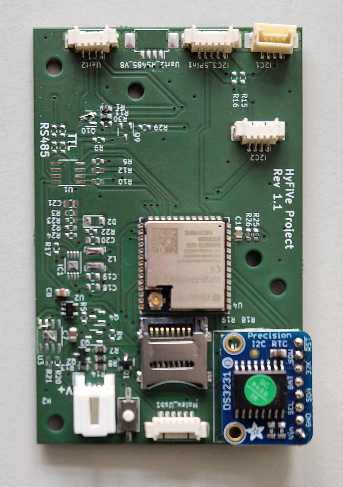
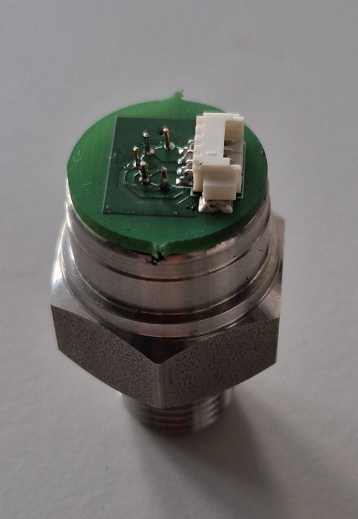

Instructions
===================
 
# Electronics
The hardware is designed and can be modified in KiCad 7. Therefore the folder **/HyfiveLib** contains custom footprints and schematics for the projects below.

## Main PCB
The main PCB is designed to run the operations of the logger. It features an ESP32 as a microcontoller and some periferal components to integrate a wide range of sensors. To assemble a PCB for a logger follow
the instructions of the BOM.md. The Logger can implement sensors by

	- 3x I2C
	- 2x UART
	- 1x RS485

To select possible sensors to implement take a look into the subfolder *04_Sensors*. The list can of course be extended. 

So far all sensors except the ones by BlueRobotics are connected with Molex PicoBlade connectors. How to cennect each sensor in hardware is descibed in the corresponding readme.

How to programm the electronics after manufacturing is explained in the subfolder *02_Software*.

A basic version of the PCB is shown in the image below.

	

## Keller connector
  
One additional PCB that is needed to implement a Keller 9LD pressure sensor is given in **/KellerConnector**. The PCB can be soldered to the pins of the sensor and can then be directly connected to I2C1 (53261-0471) of 
the main PCB with a 4 pin Molex connector (15134-0402).

	

## Battery

The power supply of the logger can be any battery pack that fits the case. We have user 12 LiPo cells in parallel (12P1S) with the connector Molex: 15136-0203. This fits to the power socket of the PCB (55935-0230).