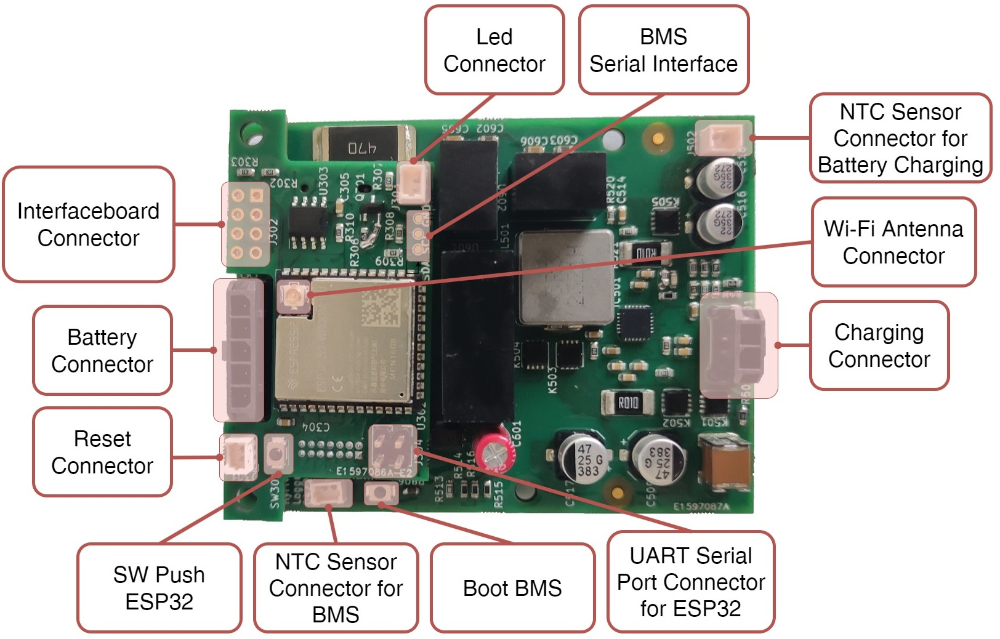
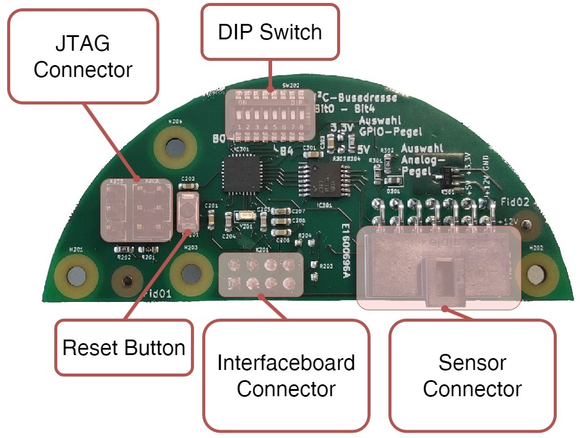
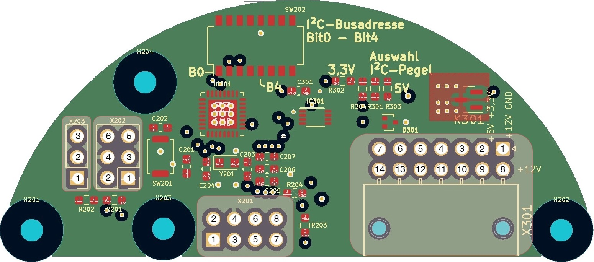
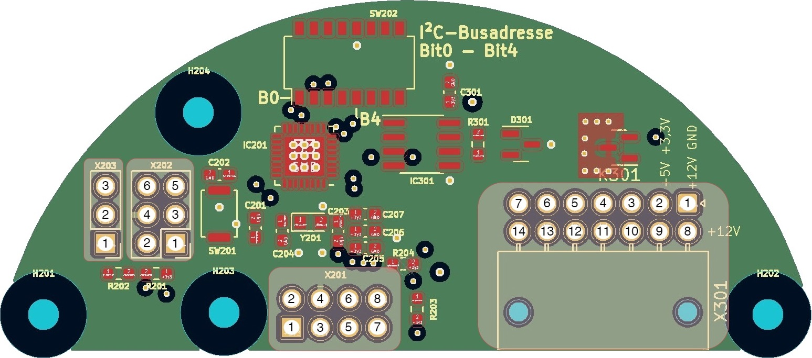
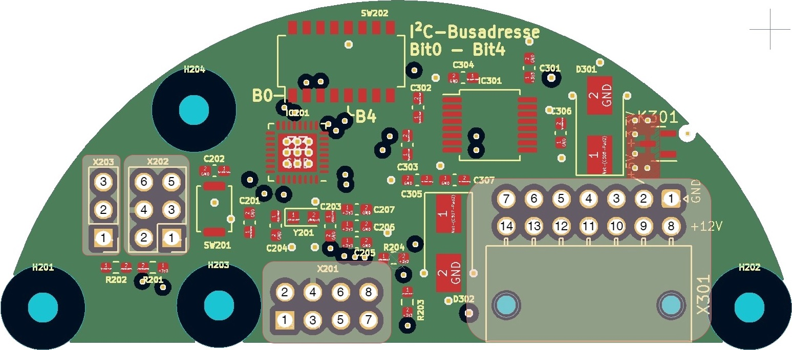
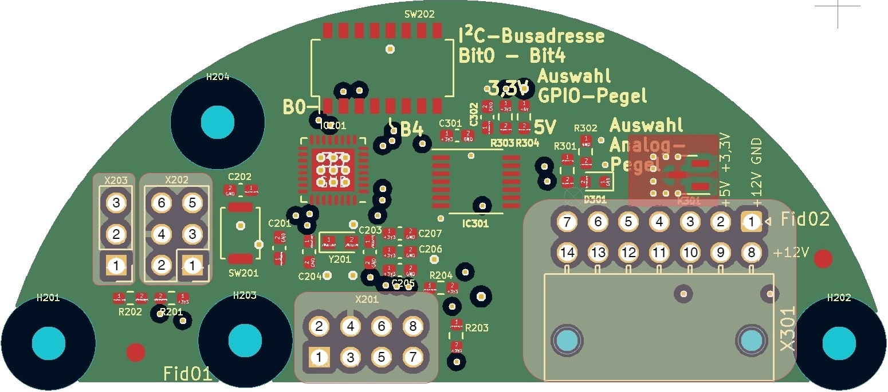
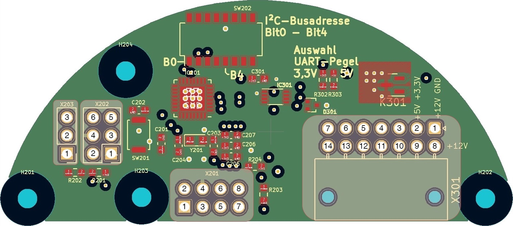
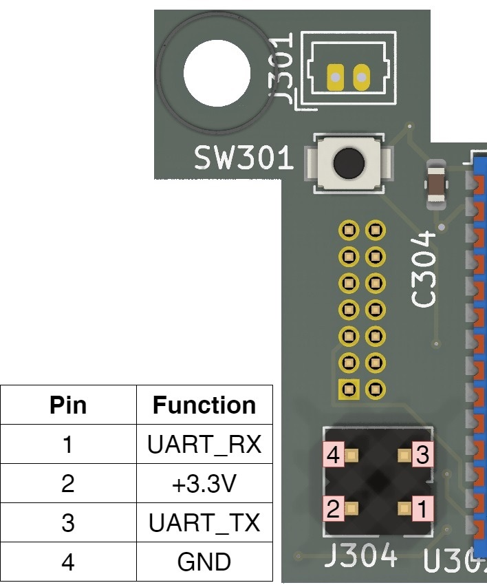
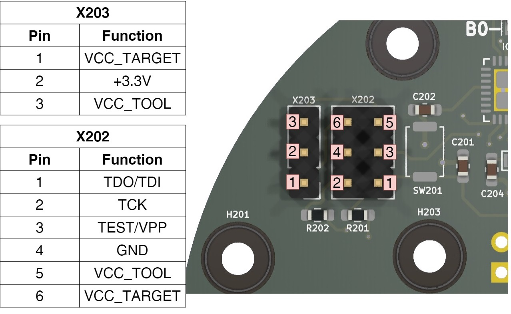

## Content

- [Logger-Mainboard (Main Unit)](#logger-mainboard-main-unit)
- [Interfaceboard (Adapter)](#interfaceboard-adapter)
- [Pinout](#pinout)
    - [Logger-Mainboard](#logger-mainboard)
    - [I2C-Adapter](#i2c-adapter)
    - [RS485-Adapter](#rs485-adapter)
    - [RS232-Adapter](#rs232-adapter)
    - [Analog-Adapter](#analog-adapter)
    - [UART-Adapter](#uart-adapter)
    - [UART Serial Port Connector for ESP32](#uart-serial-port-connector-for-esp32)
    - [JTAG Connector for Interfacebaord](#jtag-connector-for-interfacebaord)
  
---

# Logger-Mainboard (Main Unit)

1. **LED Connector**: Allows for the connection of LED indicators to provide visual status information.
2. **BMS Serial Interface**: Enables communication with the Battery Management System (BMS) for monitoring and controlling parameters.
3. **NTC Sensor Connector for Battery Charging**: Connects to an NTC sensor to monitor battery temperature during charging for safety.
4. **Wi-Fi Antenna Connector**: Attachment point for a Wi-Fi antenna to enable wireless communication.
5. **Charging Connector**: Port for connecting a power source to charge the battery.
6. **UART Serial Port Connector for ESP32**: Allows for serial communication with the ESP32 microcontroller, useful for programming and debugging.
7. **Boot BMS**: A switch to initiate the boot process for the Battery Management System.
8. **NTC Sensor Connector for BMS**: Connects to an NTC sensor for the BMS to monitor overall battery temperature.
9. **SW Push ESP32**: Enter programming/flashing mode.
10. **Reset Connector**: Connection for an external reed switch for update config file or system reset.
11. **Battery Connector**: Connection for the battery pack.
12. **Interfaceboard Connector**: I²C connection to the interfaceboards.

[Return to content](#content)

---

# Interfaceboard (Adapter)

1. **DIP-Schalter**: Used to set the bus address of the interfaceboard. This enables the board to be uniquely identified and addressed in a bus system.
2. **JTAG Connector**: Provides a connection for JTAG debugging and programming interface.
3. **Reset Button**: A button to reset the Interfaceboard.
4. **Interfaceboard Connector**: Connection to the Logger-Mainboard via I²C.
5. **Sensor Connector**: A port for connecting various types of sensors to the board for data collection.

[Return to content](#content)

---

# Pinout

### Logger-Mainboard

| Pin | J303    | J502 | J301    | J801 | J501 | BMS Serial Interface | J304    | J802      | J302             |
|-----|---------|------|---------|------|------|----------------------|---------|-----------|------------------|
| 1   | +3.3V   | TEMP | +3.3V   | GND  | VIN  | SDA                  | UART_RX | BAT PLUS  | SDA              |
| 2   | GND     | GND  | GND     | TEMP | GND  | SCL                  | +3.3V   | VC3       | SCL              |
| 3   |         |      |         |      |      | GND                  | UART_TX | VC2       | /RST             |
| 4   |         |      |         |      |      |                      | GND     | VC1       | -                |
| 5   |         |      |         |      |      |                      |         | BAT MINUS | GND              |
| 6   |         |      |         |      |      |                      |         |           | +12V             |
| 7   |         |      |         |      |      |                      |         |           | +5V              |
| 8   |         |      |         |      |      |                      |         |           | +3.3V            |

[Return to content](#content)

---

### I2C-Adapter

| Pin | X203       | X202       | X201              | X301 |
|-----|------------|------------|-------------------|------|
| 1   | VCC_TARGET | TDO/TDI    | +3.3V             | GND  |
| 2   | +3.3V      | TCK        | +5V               | +3.3V|
| 3   | VCC_TOOL   | TEST/VPP   | +12V              | -    |
| 4   |            | GND        | GND               | SCL  |
| 5   |            | VCC_TOOL   | -                 | -    |
| 6   |            | VCC_TARGET | /RST              | -    |
| 7   |            |            | SCL               | -    |
| 8   |            |            | SDA               | +12V |
| 9   |            |            |                   | +5V  |
| 10  |            |            |                   | -    |
| 11  |            |            |                   | SDA  |
| 12  |            |            |                   | -    |
| 13  |            |            |                   | -    |
| 14  |            |            |                   | -    |

[Return to content](#content)

---

### RS485-Adapter

| Pin | X203       | X202       | X201              | X301      |
|-----|------------|------------|-------------------|-----------|
| 1   | VCC_TARGET | TDO/TDI    | +3.3V             | GND       |
| 2   | +3.3V      | TCK        | +5V               | +3.3V     |
| 3   | VCC_TOOL   | TEST/VPP   | +12V              | -         |
| 4   |            | GND        | GND               | -         |
| 5   |            | VCC_TOOL   | -                 | -         |
| 6   |            | VCC_TARGET | /RST              | TX/RX LOW |
| 7   |            |            | SCL               | -         |
| 8   |            |            | SDA               | +12V      |
| 9   |            |            |                   | +5V       |
| 10  |            |            |                   | -         |
| 11  |            |            |                   | -         |
| 12  |            |            |                   | -         |
| 13  |            |            |                   | TX/RX High|
| 14  |            |            |                   | -         |

[Return to content](#content)

---

### RS232-Adapter

| Pin | X203       | X202       | X201              | X301 |
|-----|------------|------------|-------------------|------|
| 1   | VCC_TARGET | TDO/TDI    | +3.3V             | GND  |
| 2   | +3.3V      | TCK        | +5V               | +3.3V|
| 3   | VCC_TOOL   | TEST/VPP   | +12V              | TX   |
| 4   |            | GND        | GND               | -    |
| 5   |            | VCC_TOOL   | -                 | -    |
| 6   |            | VCC_TARGET | /RST              | -    |
| 7   |            |            | SCL               | -    |
| 8   |            |            | SDA               | +12V |
| 9   |            |            |                   | +5V  |
| 10  |            |            |                   | RX   |
| 11  |            |            |                   | -    |
| 12  |            |            |                   | -    |
| 13  |            |            |                   | -    |
| 14  |            |            |                   | -    |

[Return to content](#content)

---

### Analog-Adapter

| Pin | X203       | X202       | X201              | X301        |
|-----|------------|------------|-------------------|-------------|
| 1   | VCC_TARGET | TDO/TDI    | +3.3V             | GND         |
| 2   | +3.3V      | TCK        | +5V               | +3.3V       |
| 3   | VCC_TOOL   | TEST/VPP   | +12V              | -           |
| 4   |            | GND        | GND               | -           |
| 5   |            | VCC_TOOL   | -                 | -           |
| 6   |            | VCC_TARGET | /RST              | -           |
| 7   |            |            | SCL               | Analog Input|
| 8   |            |            | SDA               | +12V        |
| 9   |            |            |                   | +5V         |
| 10  |            |            |                   | -           |
| 11  |            |            |                   | -           |
| 12  |            |            |                   | -           |
| 13  |            |            |                   | -           |
| 14  |            |            |                   | -           |

[Return to content](#content)

---

### UART-Adapter

| Pin | X203       | X202       | X201              | X301    |
|-----|------------|------------|-------------------|---------|
| 1   | VCC_TARGET | TDO/TDI    | +3.3V             | GND     |
| 2   | +3.3V      | TCK        | +5V               | +3.3V   |
| 3   | VCC_TOOL   | TEST/VPP   | +12V              | -       |
| 4   |            | GND        | GND               | -       |
| 5   |            | VCC_TOOL   | -                 | TXD/TCK |
| 6   |            | VCC_TARGET | /RST              | -       |
| 7   |            |            | SCL               | -       |
| 8   |            |            | SDA               | +12V    |
| 9   |            |            |                   | +5V     |
| 10  |            |            |                   | -       |
| 11  |            |            |                   | -       |
| 12  |            |            |                   | RXD/TMS |
| 13  |            |            |                   | -       |
| 14  |            |            |                   | -       |

[Return to content](#content)

---

### UART Serial Port Connector for ESP32

[Return to content](#content)

---

### JTAG Connector for Interfacebaord

[Return to content](#content)

---

