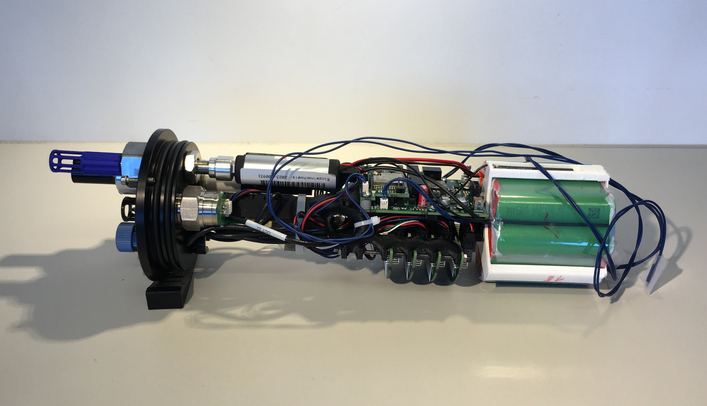
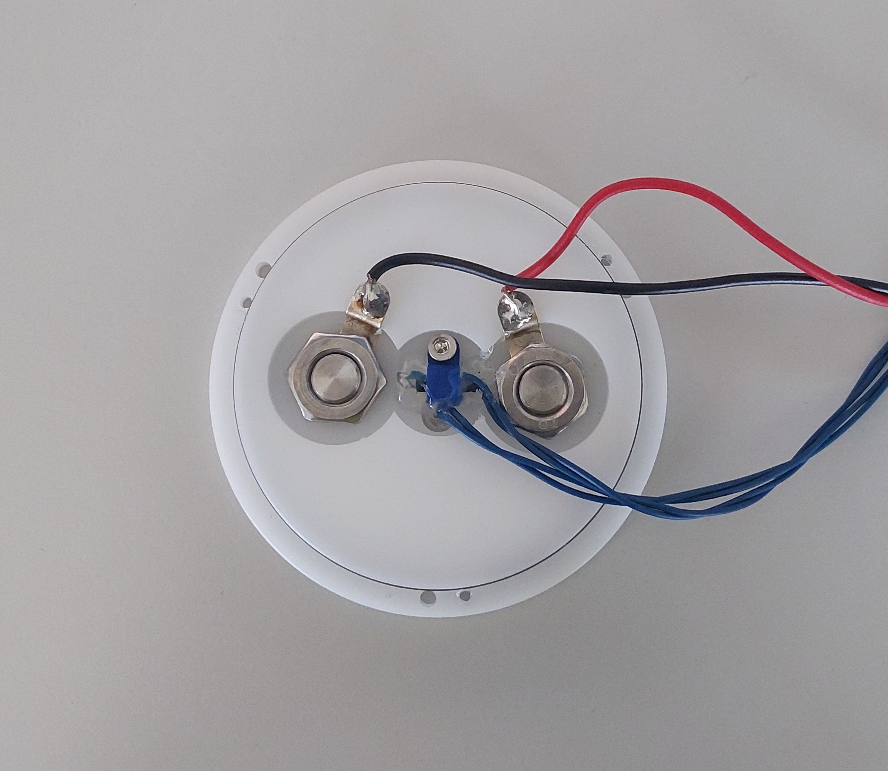

# Mechanics: Differences of Modular Logger to Basic Logger

The mechanic hardware is almost the same for the basic and the modular version of the logger. For a detailed description of this topic please go to [01_Logger/01_Basic_Logger/02_Mechanics](../../01_Basic_Logger/02_Mechanics/README.md).

There are only two differences to the basic logger:

## Electronic Mounting
As the PCBs differ between the logger versions, their 3D-printed mountings differ as well. The mounting for the modular logger is published in this folder.

The interface PCBs have the shape of a semicircle and are positioned perpendicular to the cylinder axis (looking like rips). They are stacked and attached to the mounting by two M2.5 thread rods, so only two nuts need to be fasten on each side to fix the hole stack. 

<figure> 
   
   
   
   <figurecaption><a name="figure1">*Figure 1:*</a> *Electronic mounting of modular logger without (left) and with electronics (right). Notice the tread rod to fix the interface boards, which are stacked and positioned as "rips"*</figurecaption>
</figure>

## Self-Designed Penetrators for Charging and Integration of LED and Magnetic Sensor
The end cap of the modular logger, which is not equipped with sensors, is used to contain additional functionalities. Therefore the blank end caps need to be postprocessed according to the drawing in this folder. 

For charging batteries without opening the pressure housing, charging contacts need to be fed through the end cap. For this purpose, we designed a penetrator which offers 2 O-ring grooves, a flange to rest on the outside, a M10 thread for securing on the inside and a drill hole of 4 mm diameter to receive a banana plug. On the inside a wire is connected to the penetrator, by soldering it to an extension of a washer. 

<figure> 
	
	

<figurecaption><a name="figure2">*Figure 2:*</a> *Left: Self designed charging contact. Right: Charging contacts, LED and magnetic switch inserted into endcap - notice attachment of wires to charging contacts by soldering to an extension of a washer*</figurecaption>
</figure>

A feedback LED is integrated by placing it into a partly drilled hole in a white end cap. The remaining wall thickness is thick enough to meet the pressure requirements and small enough to transmit enough LED light. 

Close to the LED a magnetic sensor (REED switch) is positioned, e.g. for resetting the logger. A small 3D printed mounting can be used to fix it in position (or some hot glue). LED and magnetic sensor are positioned in the middle of the end cap, so the operator knows where to look for a signal or place the magnet. 

<figure> 
   

   <figurecaption><a name="figure3">*Figure 3:*</a> *Modular logger charging including the corresponding LED feedback*</figurecaption>
</figure>

# Bill of Material
The following mechanical material is needed to build a modular logger (in addition to the PCBs and electrical components).

| #  | Amount | Name                                                                  |
| -- | ------ | --------------------------------------------------------------------- |
|    |        | **Pressure cylinder**                                                     |
| 1  | 1      | Cylinder, POM, D 76/90, L 275, according to drawing                   |
| 2  | 1      | End cap for sensors, according to drawing                             |
| 3  | 1      | End cap for charing, according to drawing                             |
| 4  | 6      | Screws M3 x 14, hexagonal, stainless A4                               |
| 5  | 4      | O-ring 70 x 3, NBR70                                                  |
| 6  | 1      | O-ring lube, e.g. Molycote 44 Medium                                  |
|    |        | **Internal mounting**                                                    |
| 7  | 1      | Mounting for electronic components, 3D printed                        |
| 8  | 1      | Mounting for battery pack, 3D printed                                 |
| 9  | 4      | Tapping screw, M2.9 x 9.5, for attaching main PCB                     |
| 10 | 1      | Screws M6 x 14, hexagonal                                             |
| 11 | 2      | Thread rod M2.5, length 75 mm                                         |
| 12 | 4      | Nuts M2.5                                                             |
|    |        | **Sensors and accessories**                                               |
| 13 | 1      | Temperature: BlueRobotics Celsius Fast Responde, incl. O-ring and nut |
| 14 | 1      | Pressure: Keller 20D, 50bar, incl. adapter PCB                        |
| 15 | 1      | Oxygen: Pyroscience picoO2sub incl. Oxycap-sub, O-ring and nut        |
| 16 | 1      | Conductivity: Atlas Scientific K1.0 incl. adapter board               |
| 17 | 1      | Bushing for conductivity sensor, incl. distance sleeve for potting    |
| 18 | 1      | Nut M18x1 ('Sechskant-Gegenmutter')                                   |
| 19 | 2      | O-ring, 15.5 x 2, NBR70                                               |
| 20 | 1      | Pressure valve, BlueRobotics PRV-R1, incl. O-rings and nut            |
| 21 | 1      | Vacuum pump, BlueRobotics Vacuum-Pump-R1, incl. adapter for PRV       |
|    |        | **Penetrators Charging side**                                             |
| 22 | 2      | Penetrator for charging, according to drawing                         |
| 23 | 4      | O-ring 8.5x 1.5, NBR70                                                |
| 24 | 2      | Nut M10, hexagonal, flat, stainless A4, DIN439/ISO4035                |
| 25 | 2      | Washer with single head solder terminal, M2.2xM10.2, tinned copper    |
| 26 | 1      | Mounting for reed switch incl. 1 M3x8 hex screws                      |

