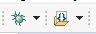

# Content
- [Complete Measurement Cycle](#complete-measurement-cycle)
- [Programming Guide: Logger-Mainboard and Interfaceboard](#programming-guide-logger-mainboard-and-interfaceboard)
  - [Logger-Mainboard Programming](#logger-mainboard-programming)
    - [1. Installing VSCode and PlatformIO IDE](#1-installing-vscode-and-platformio-ide)
    - [2. Opening a Project with PlatformIO](#2-opening-a-project-with-platformio)
    - [3. Compiling the Code](#3-compiling-the-code)
    - [4. Flashing and Debugging](#4-flashing-and-debugging)
    - [5. Alternative Firmware Update Method (Updates without Programming Device)](#5-alternative-firmware-update-method-updates-without-programming-device)
  - [Interfaceboard Programming](#interfaceboard-programming)
    - [1. Programming Preparations](#1-programming-preparations)
      - [Standard Connection Configuration](#standard-connection-configuration)
      - [Alternative Connection Configuration](#alternative-connection-configuration)
    - [2. Software Installation and Setup](#2-software-installation-and-setup)
    - [3. Importing the Project](#3-importing-the-project)
    - [4. Compiling the Project](#4-compiling-the-project)
    - [5. Flashing Firmware and Debugging](#5-flashing-firmware-and-debugging)
    - [6. After Programming](#6-after-programming)
  - [BMS Programming](#bms-programming)
    - [1. Prerequisites](#1-prerequisites)
    - [2. Software Setup](#2-software-setup)
    - [3. Hardware Connection](#3-hardware-connection)
    - [4. Firmware Update Procedure](#4-firmware-update-procedure)
    - [5. Troubleshooting](#5-troubleshooting)
- [Resetting the Logger](#resetting-the-logger)
- [Logger Configuration Update](#logger-configuration-update)
- [LED Behavior](#led-behavior)

# Complete Measurement Cycle

1. Waking up and Initialization:
   - The logger wakes up from deep sleep.
   - The system initializes itself.

2. Environment Check:
   - The logger checks if it's underwater using `checkWetSensorThreshold()`.
   - If underwater, `performUnderWaterOperations()` is executed.

3. Sensor Activation:
   - `setRequiredVoltage(true)` activates the necessary voltages for the sensors.
   - `Logger.sensorWakeupAll()` wakes up all sensors.

4. Measurement Preparations:
   - `createConfigHeader()` creates the configuration header for the measurement.

5. Measurement Loop:
   - `startConversionformUnderWaterOperations()` initiates the conversion for all active sensors.
   - `updateSensorMeasurements()` performs the actual measurements.
   - For each sensor that needs to take a measurement, `performSensorMeasurement()` is called.

6. Data Processing:
   - Measurement values are stored in `sensorValue` and `sensorValueRaw`.
   - `writeMeasurementDataToFile()` writes the data in JSON format to a file.

7. Special Checks:
   - `checkDryCondition()` checks if the logger is still underwater.
   - `performSampleCast()` checks if a faster measurement cycle ("Cast") is necessary.

8. Data Transmission (if possible):
   - If Wi-Fi is available, data is transmitted via MQTT (`transmitDataViaMqtt()`).

9. Periodic Tasks:
   - Additional functions are executed at regular intervals:
     - `configUpdatePeriodeFunktion()` for configuration updates
     - `statusUploadPeriodeFunktion()` for status uploads
     - `wetDetPeriodeFunktion()` for wet detection
     - `dataUploadRetryPeriodeFunktion()` for data upload retry attempts

10. Ending Underwater Mode:
    - If dryness is detected, the system calls `terminateUnderwaterMode()`.
    - This deactivates sensors, moves data, and prepares the system for surface mode.

[Return to content](#content)

# Programming Guide: Logger-Mainboard and Interfaceboard

## Logger-Mainboard Programming

### 1. Installing VSCode and PlatformIO IDE

1. Visit the official VSCode website: [https://code.visualstudio.com/Download](https://code.visualstudio.com/Download)
2. Open Visual Studio Code after installation.
3. Open the Extensions view:
   - Click on the Extensions icon in the left sidebar, or
   - Use the keyboard shortcut: `Ctrl+Shift+X`
4. Search for "PlatformIO IDE" in the search field.
5. Click the "Install" button to install the extension.
6. Wait for the installation to complete. VSCode may request a restart.

### 2. Opening a Project with PlatformIO

1. After installing PlatformIO, a new PlatformIO icon will appear in the left sidebar of VSCode. 
2. Click on the PlatformIO icon.
3. In the PlatformIO view, select `Home` -> `Open Project`.
4. Navigate to your project directory.
5. Select the folder containing the `platformio.ini` file.
6. Click "Open" to load the project in VSCode.

> - A stable internet connection is required as PlatformIO may need to download additional dependencies.
> - When opening a project for the first time, it may take some time for PlatformIO to initialize all necessary components.

### 3. Compiling the Code

1. To compile the code:
   - Click on the checkmark icon (Build)  in the bottom status bar, or
   - Use the shortcut `Ctrl+Alt+B`
2. The compilation process will be displayed in the Terminal view of VSCode.

### 4. Flashing and Debugging

1. Connect the UART programmer to the ESP32 board, [see UART Serial Port Connector for ESP32](../01_Electronics/README.md).
2. Flash the firmware:
   - Click on the arrow icon (Upload)  in the status bar or use `Ctrl+Alt+U`.
3. Open the Serial Monitor for monitoring:
   - Click on the plug icon (Serial Monitor)  or use `Ctrl+Alt+S`.

### 5. Alternative Firmware Update Method (Updates without Programming Device)

1. Locate the compiled firmware under `.pio\build\HyFiVe_Logger-Mainboard\firmware.bin`.
2. Copy this file to the "updateFW" folder on the logger's SD card.
3. The new firmware will be automatically installed on the next start.

[Return to content](#content)

## Interfaceboard Programming

### 1. Programming Preparations

#### Standard Connection Configuration
1. Ensure the Interfaceboard is unpowered.
2. Place a jumper on X203 between Pin 1 and Pin 2, [see JTAG Connector for Interfaceboard](../01_Electronics/README.md).
3. Connect +3.3V to the pin header X201 (Pin1: +3.3V, Pin4: GND), [see Pinout of Interfaceboard Connector](../01_Electronics/README.md).
4. Connect the TI MSP-FET Flash Emulation Tool (programming connector) correctly, [see JTAG Connector for Interfaceboard](../01_Electronics/README.md).
5. Turn on the power supply.

#### Alternative Connection Configuration
> ⚠️ Caution is advised with this configuration to avoid potential overload of the programmer. Ensure the programmer is designed for the required current output.

1. Ensure the Interfaceboard is unpowered.
2. Place a jumper on X203 between Pin 2 and Pin 3, [see JTAG Connector for Interfaceboard](../01_Electronics/README.md).
3. Connect the TI MSP-FET Flash Emulation Tool (programming connector) correctly, [see JTAG Connector for Interfaceboard](../01_Electronics/README.md).
4. Turn on the power supply.

### 2. Software Installation and Setup

1. Download Code Composer Studio (CCS): [https://www.ti.com/tool/CCSTUDIO#downloads](https://www.ti.com/tool/CCSTUDIO#downloads).
2. Select "CCSTUDIO — Code Composer Studio™ IDE" (tested with versions 10.4.0 and 12.8.0).
3. Perform a full installation.
4. On first launch, create a workspace (do not create it in the project folder).

### 3. Importing the Project

1. Navigate to: `File` -> `Import...`
2. Select: `C/C++` -> `CCS Projects` -> `Next`
3. Use `Browse...` to select the Interfaceboard folder containing the `main.c` file.
4. The project will appear under `Discovered projects` and should already be marked.
5. Click `Finish` to complete the import.

### 4. Compiling the Project

1. Go to the "Build" menu.
2. Select "Debug_TI(2)".
 .jpg)

3. The project will now compile and should run without errors.
> - if msp430ware is not installed, install it offline via `View` -> `Resource Explorer`. 
> - if libmath.a is not found, change it through `Project` -> `Properties` -> `MSP430 Linker` -> `File Search Path` -> libmath.a to C:\ti\ccs1281\ccs\ccs_base\msp430\lib\5xx_6xx_FRxx\libmath.a. Make sure the path is correct on your system -> Apply and Close
### 5. Flashing Firmware and Debugging

1. Use the Flash icon to transfer the created firmware to the Interfaceboard.
2. Use the Debug function to analyze and test the program.

### 6. After Programming

1. Turn off the power supply.
2. Remove the programming connector.
3. Remove the jumper from X203.

[Return to content](#content)

## BMS Programming

### 1. Prerequisites
- Ensure the battery voltage and charging voltage of 19V are applied to prevent firmware update failures.
- The ESP32 must be in `programBms()` state. Adjust this in the `main.cpp` file.

### 2. Software Setup
1. Download Battery Management Studio (bqStudio) Software from [TI's BQ40Z80 product page](https://www.ti.com/product/BQ40Z80).
   - Select "BQSTUDIO-STABLE — Battery Management Studio (bqStudio) Software"
   - Choose the stable version for bq series TI battery fuel gauges.
  
### 3. Hardware Connection
Connect the [BQ40Z80EVM-020](https://www.ti.com/tool/BQ40Z80EVM-020) to the BMS on the Logger-Mainboard (BQ40Z80):
- Connect pin SMBD1 on BQ40Z80EVM-020 to SDA on Logger-mainboard 'BMS Serial Interface'
- Connect pin SMBC1 on BQ40Z80EVM-020 to SDC on Logger-mainboard 'BMS Serial Interface'

### 4. Firmware Update Procedure
1. Open bqStudio and connect to the BMS(BQ40Z80).
2. Navigate to the Firmware section.
3. In the Program area, select the appropriate firmware file (with .srec extension).
4. Click the "Program" button to initiate the firmware upload.

### 5. Troubleshooting
If the firmware update process is interrupted or fails:
1. Manually select the chip:
   - Navigate to: Gauge -> 4800_0_04-bq40z80.bqz
2. Retry the firmware update process.

[Return to content](#content)

# Resetting the Logger
The logger can be reset in case of an error using the `reed switch`. Hold a magnet to the switch for over 5 seconds to initiate a reset. However, if the BMS error detection has triggered and shut down the logger, you must press the `Boot BMS` button on the `Logger-Mainboard`.

[Return to content](#content)

# Logger Configuration Update
The configuration update can be initiated in two ways:
1. Through the fixed cycle via `configUpdatePeriodeFunktion()`.
2. Manually using the reed switch with a magnet. When the LED lights up, it indicates that the config update cycle has been initiated.

[Return to content](#content)

# LED Behavior
See [Excel](media/LED_signals_rev1_1.xlsx). file for details.

[Return to content](#content)