Akku in die akkuhalterung plazieren wlan antenne befestigen

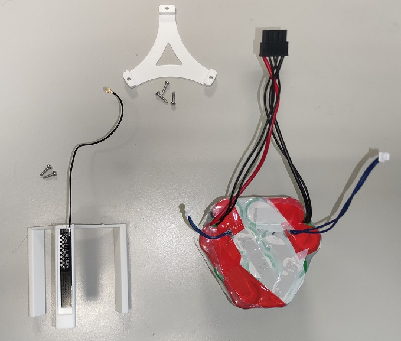

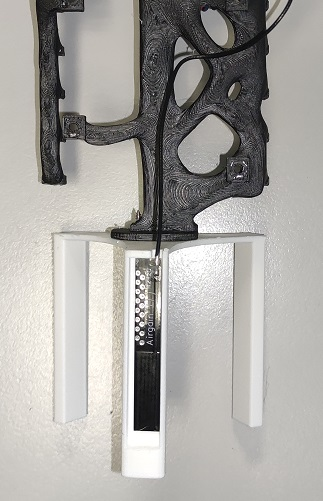

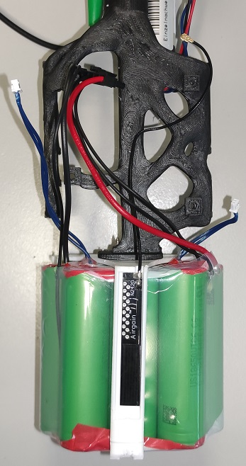

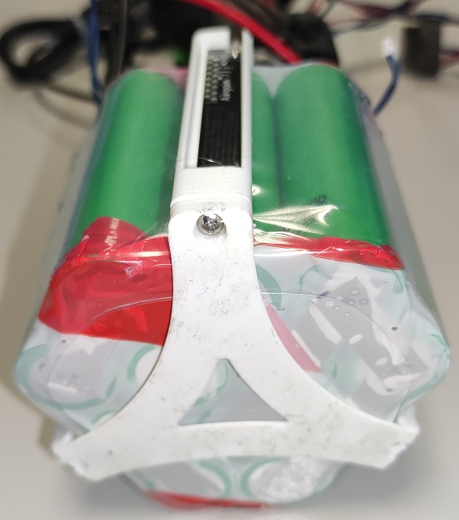

Messensoren befestigen
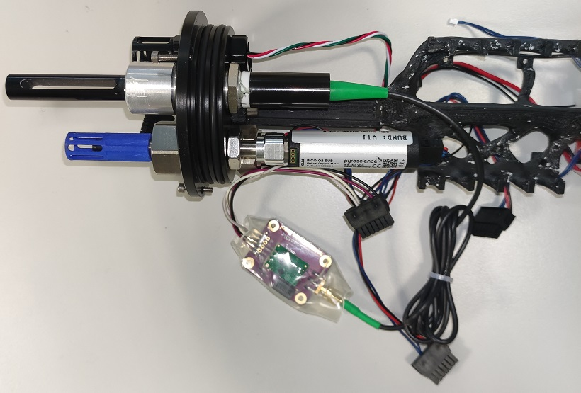

Mainboard mit den Interfaceboard verbinden, auf die plarietät des stecker ahten

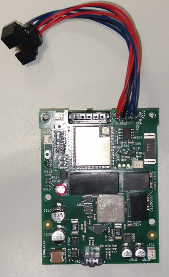

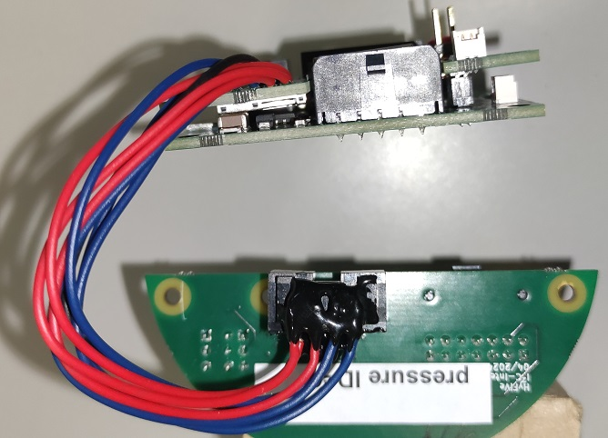

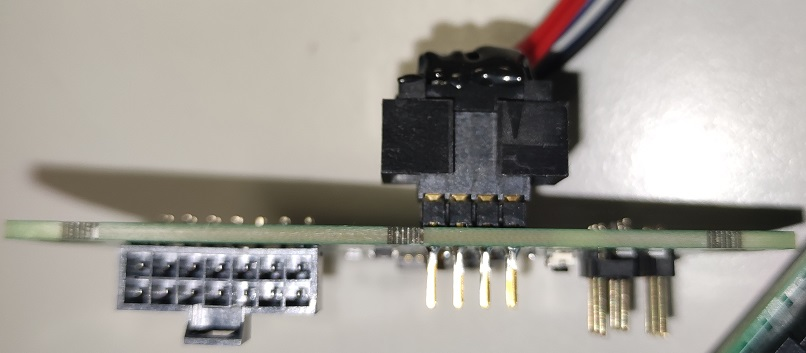

Teile verschrauben ntx stecker steckensoiwe led und reed schalter stecker stecken, lade stecker

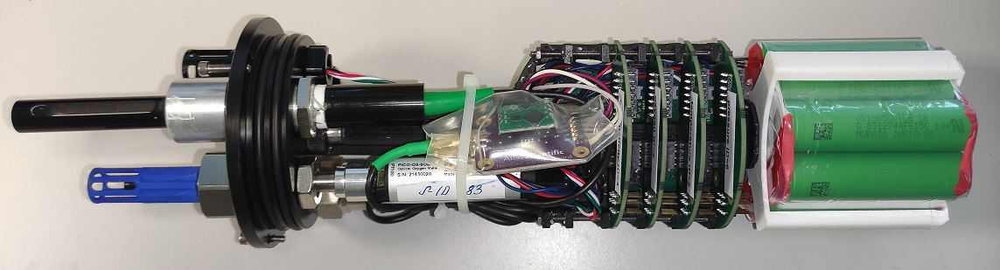

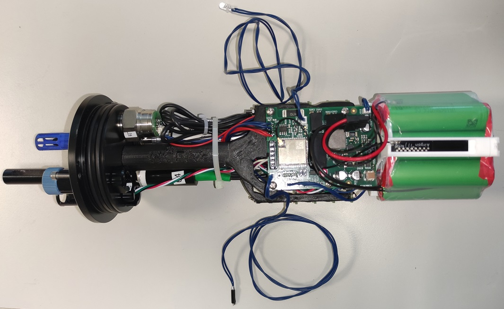

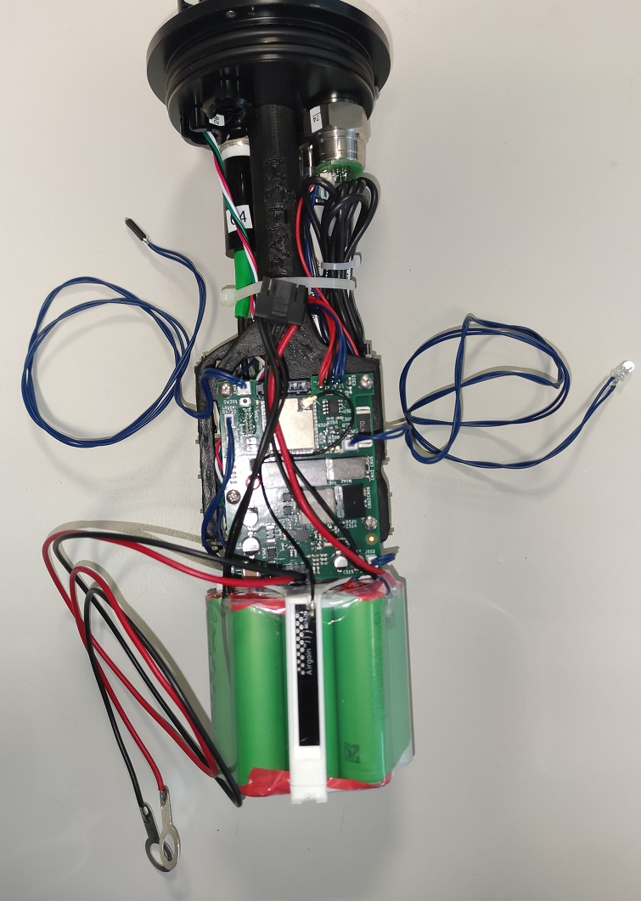

LED und redschalter befestigen und mit heißkleber verkleben

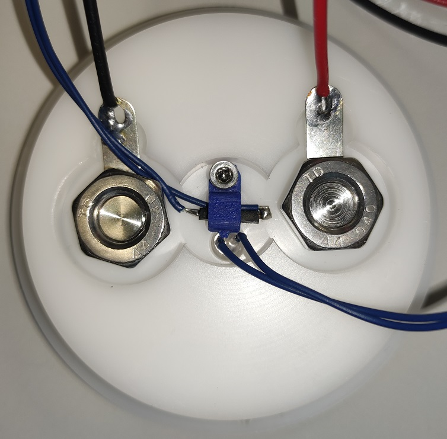

Akku spannung an das mainboard stecken und boot bms tast betätigen, das board startet und kann zusamengebaut werden

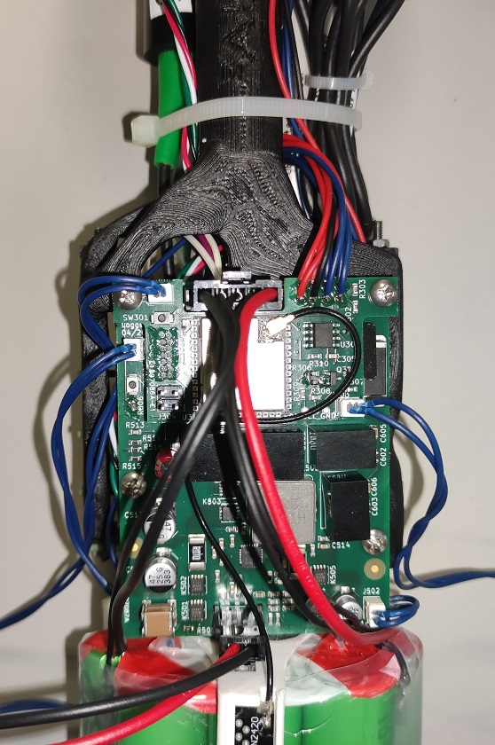

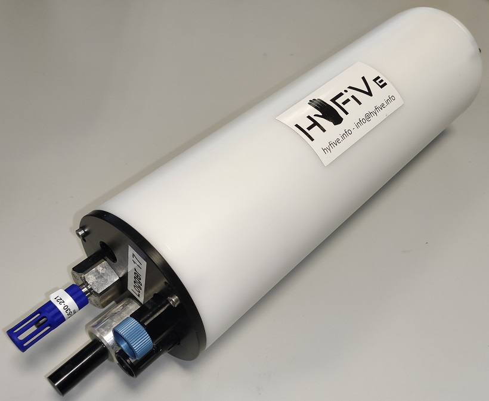

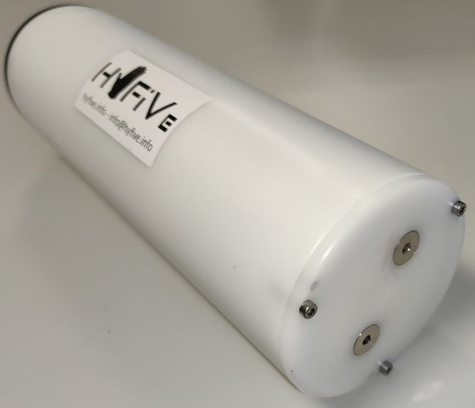