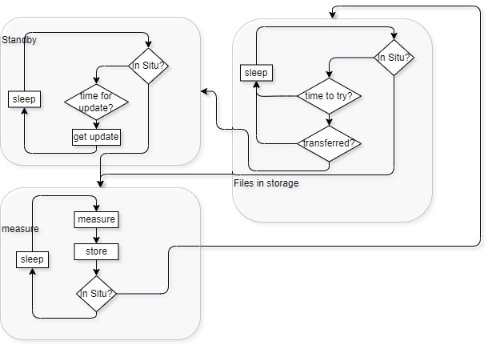

Software
=====

# Configuration File

The configuration file contains important inforamtion on the loggers behaviour and is placed on its SD card.

## File preparation
Prepare a configuration JSON file with the configuration interface installed on the server (e.g. hyfive.info:4000). The configuration file contains information from the database such as
- *logger_id*
- *operation_mode*
- *fw_version*
- *num_sensors*	- number of sensors
- *deckunit_id*
- *platform_id*
- *vessel information* - vessel_name, vessel_id
- *contact information*
- *sensor inforamtion* - sensor_ids, calbration information, sensor_type

and other additional inforamtion for the functionality:
- *WiFi credentials*
- *config_update_periode*		- interval in seconds when to check for update
- *status_upload_periode*		- interval in seconds when to upload new status
- *sample_periode*		- interval in seconds in which to sample
- *sample_cast_enable*
- *sample_cast_periode*
- *cast_det_sensor*		- id of the sensor that detects the cast
- *cast_det_sensor_threshold*	- threshold to detect a cast
- *wet_det_sensor*		- id of the sensor that detects the sensor is in-Situ
- *wet_det_periode*		- interval in seconds to check if the logger has entered the water
- *wet_det_threshold*		- threshold to detect if the logger has entered the water
- *dry_det_sensor*		- id of the sensor that detects the logger left the water
- *dry_det_threshold*		- threshold to detect if the logger has left the water
- *dry_det_verify_delay*	- time in seconds after which the logger will transmitt the measured data
- *data_upload_retry_periode*	- interval in seconds  after which the logger will try to transmitt data again, if it did not work the las time

A demonstation file is given with logger_10_config_202405071357.json

## Micro SD card
Prepare a micro SD card (4GB) formatted in FAT32 with the following folders and a configuration file to then insert it into the micro SD card holder J9 on the PCB:
```
\measurements\
\info\
	header\
	config\
		config_file.json
\backup\
	measurements\
```

# Software to run the logger with all features

The logger is programmed in C++ with the PlatformIO plugin of VS Code and uses the arduino framework.

The software runs on the microcontoller of the logger. The code integrates multiple sensors that are attached to the electronics, collects their measured values
and stores them on an SD card. It is able to detect the state (inside or outside of the water) by readings of the sensors. After surfacing it transfers the data wireless.
A state machine of the software is given in the figure below. Libraries with functions to take readings of the sensors musst be implemented into the code according to
the hardware setup. Taking timing of sensors and their cahracteristics into account is important to look into before deploying a system.

<figure> 
   

   <figurecaption><a name="figure1">*Figure 1:*</a> *Flowchart of the software*</figurecaption>
</figure>

To adapt the software it is important to look into the functions:

- Logger::init(): reads in the config file and sets up some important behaviour
- measure(&sample): takes reading of the sensors. In this timing of the individual sensors must be met to read them out properly and not have a long delay. Some sensors, such as oxygen, are compensated by temperature 
and need the value in before.
- loop(): the main loop with the state machine

# Flash the ESP32
The UART programmer listed in the BOM of the folder *01_Hardware* can be used to flash the ESP32. The pins should be connected to the Molex 15134-0602 as follows where pin DTR on the PCB (lowest one of the Molex connector 
in the picture) must be unpluggable easily from CTS of the programmer. We recommend using a female pin header.

<figure> 
   

   <figurecaption><a name="figure2">*Figure 2:*</a> *Connection of the programmer to Molex 15134-0602 with a female pin header on the lowest pin.*</figurecaption>
</figure>

The PCB is powerd by the battery and not the USB. The flow of programming is as follows:
1. Connect DTR to CTS.
2. Supply the PCB with power.
3. Click PlatformIO: Upload
4. When the terminal shows "Connecting to Port x: ...." press the button until the process continues
5. Disconnect DTR after the process is done
6. Clink PlatformIO: Serial Monitor to view the output and reboot the PCB