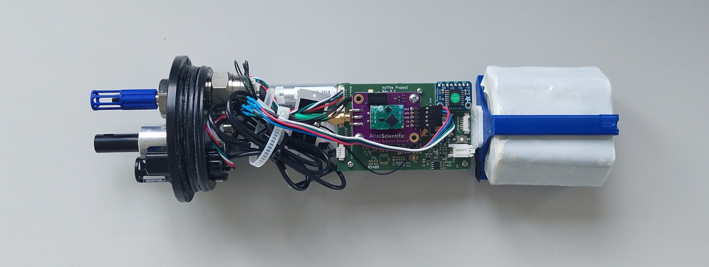

# Logger

The HyFiVe logger is an autonomous measuring unit, which can be attached to fishing gear. It consists of a pressure housing, internal electronics and firmware as well as sensors. 

Sensors: We integrate third-party (OEM) sensors. We are not limited to specific measurement parameters or manufactures. Many different sensors can be integrated, so the system can be adapted to your use case. So far we implemented and tested thoroughly sensors for conductivity, temperature, pressure (CTD) and oxygen.

Measurement process: The logger checks regularly if it is immersed into water. When the beginning of a deployment is detected, the state of logger is changed and it starts measuring with a prescribed period. When the logger is above the water surface again, this is also detected and the logger transmits the data via Wifi MQTT to the deck box. 

Config update: The configuration of the logger can be changed by altering config parameters, which are contained in a config.json file. The logger tries in regular intervals (which are also a config parameter) to connect to the deck box and asks, if a new config is available for it. If so, it is transmitted via Wifi MQTT.

## Different Versions of HyFiVe Loggers

We developed two versions of HyFiVe loggers. The HyFiVe deck box and the server do not need to be adapted to the logger version, they work with both.

There is no significant difference between the two versions regarding: 
- Mechanics (Only one end cap and the internal mountings are different)
- Sensors

The main differences between both versions are explained below. Both versions are explained in detail in the corresponding subfolders. 

### Basic Logger
The [basic logger](./01_Basic_Logger/) was developed by building prototypes from an early stage on (agile development). The prototypes were deployed in field tests and the results used to improve the design. Until the end of the first HyFiVe project in Sept 2024, all measuring campaigns on more than 10 vessels were conducted with this logger version. 

The electronic design is straight forward and easier to reproduce than the modular logger. It is based on only one PCB. All sensors are directly interfaced to micro controller on the PCB. 

<figure> 
   

   <figurecaption><a name="figure1">*Figure 1:*</a> *Electronics of basic logger*</figurecaption>
</figure>

### Modular Logger
The [modular logger](./02_Modular_Logger/) offers more functionalities and it's design is more complex. The development took more time, so the prototypes could only be tested in harbour tests until the end of the first HyFiVe project in Sept 2024. 

The modularity is the main difference between both versions: In the modular logger each sensor is connected to one interface PCB. All interface PCBs are connected to a main PCB. The communication between main PCB and interface PCB is standardized. In this way, all sensor specific things can be encapsulated on the interface PCB.

In comparison to the basic version, the modular logger offers the following additional features: 
 - Modular design facilitates integrating and changing sensors, s. above.
 - Battery management
 - Charging of batteries without opening pressure case 
 - LED for feedback
 - Magnetic switch, e.g. for resetting the logger
 - Easier update of logger configuration: Manual trigger of update with magnet possible, more config parameters available, more precautions taken for stable config update
 - Error Log
 - Special operation modes possible: Change of sample rate for single sensors or during down- and upcast
 
<figure> 
   

   <figurecaption><a name="figure2">*Figure 2:*</a> *Electronics of modular logger*</figurecaption>
</figure>