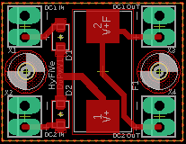
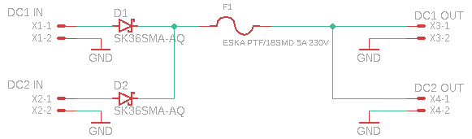

# Deck box - PCB for Power Distribution

Both power inputs of the deck box (DC and AC) are fed into this PCB (AC after converting to DC). The PCB holds a fuse and two diodes for backflow protection. So both power inputs can be connected at the same time without damage, and also both inputs are fed through the fuse.

More comprehensive documentation in [../../README.md](../../README.md)

<figure> 
   

   <figurecaption>*Functionality of PCB shown in diagram of power flow inside the deckbox*</figurecaption>
</figure>

---

<figure> 
   

   <figurecaption>*Picture of Board Design Rule file*</figurecaption>
</figure>

---

<figure> 
   

   <figurecaption>*Schematics of power distribution PCB*</figurecaption>
</figure>