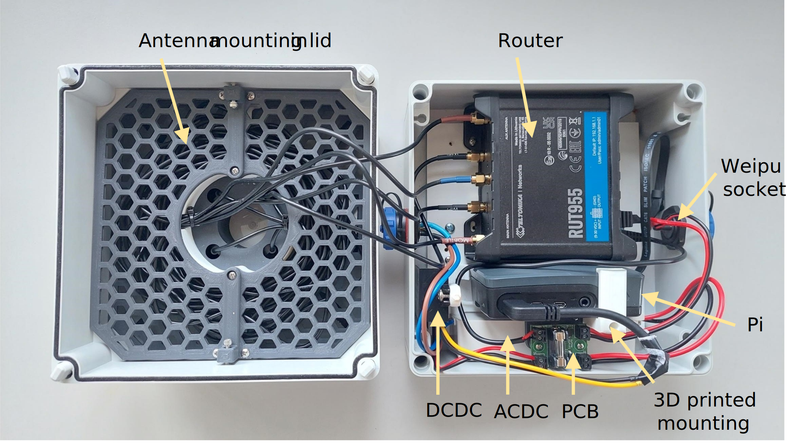
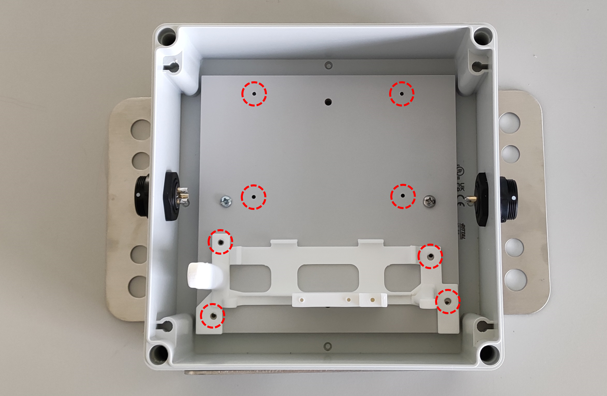
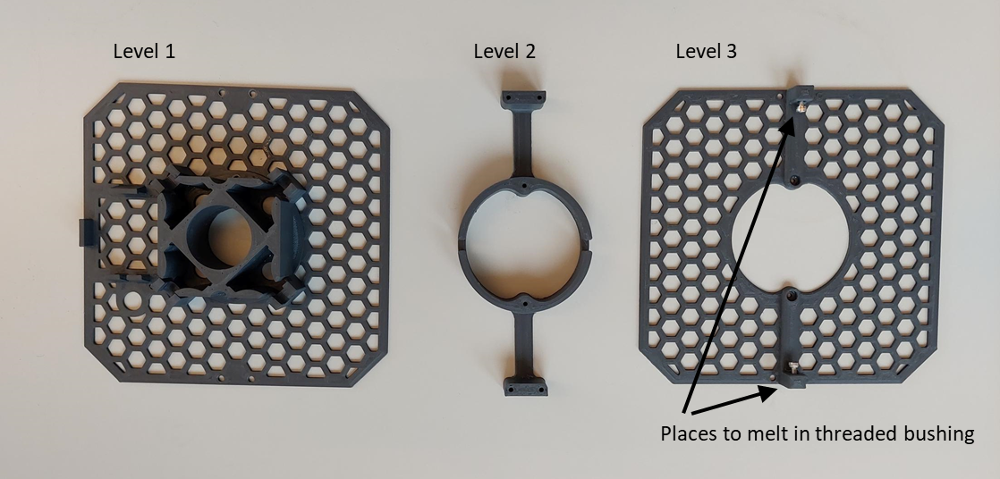
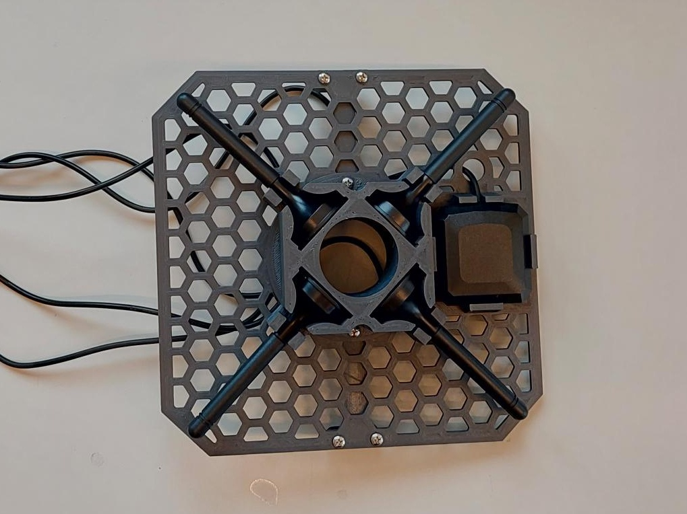
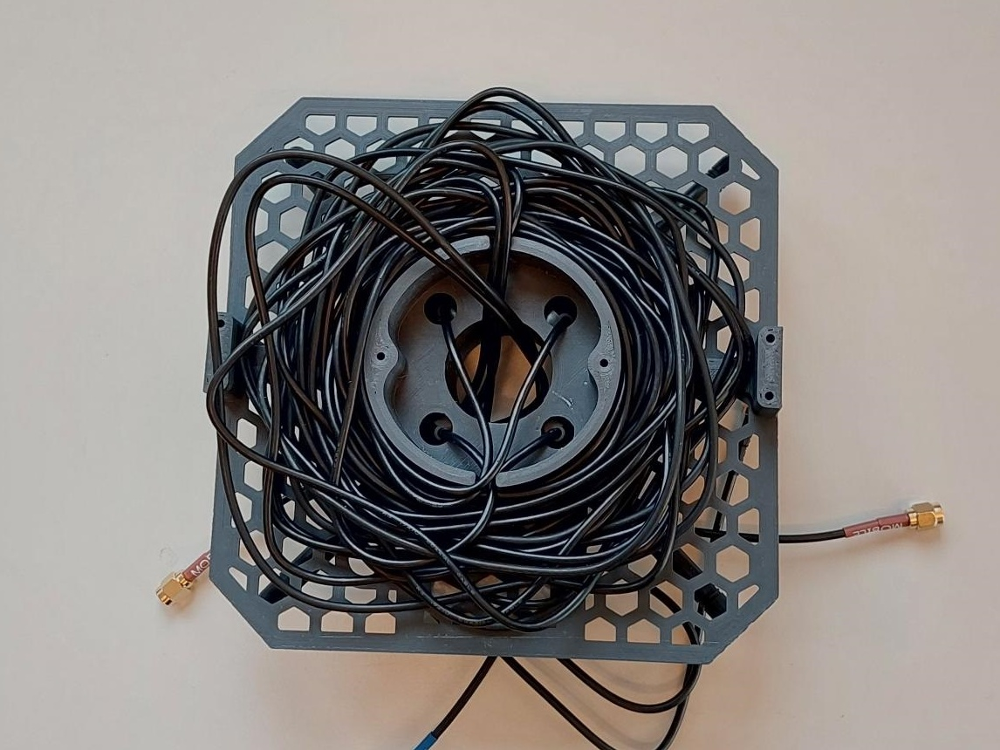
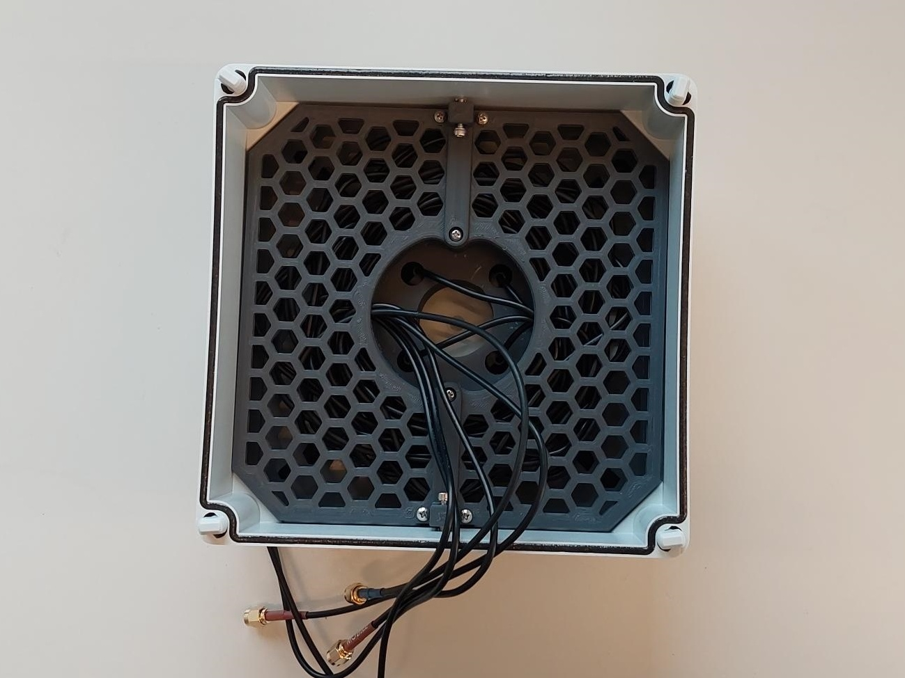
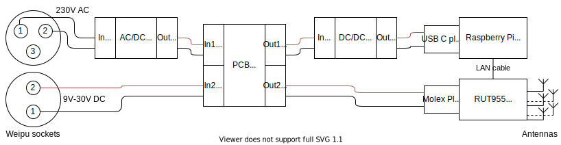

# Deck Box 2.0 - Hardware

## Bill of Material

The following parts are needed to manufacture a HyFiVe deck box.

| #  | Amount | Unit | Name                                                                                                                        | GTIN                                  |
| -- | ------ | ---- | --------------------------------------------------------------------------------------------------------------------------- | ------------------------------------- |
|    |        |      | **Electronic components**                                                                                                     |                                       |
| 1  | 1      | pc   | Raspberry Pi 4 B 4GB ram , incl. Micro SD card (min 8 GB) and official case                                                 | 0765756931182  644824914923           |
| 2  | 1      | pc   | Router Teltonika RUT955 incl. supplied antennas (2 x wifi, 2 x mobile data, 1 x GPS)                                        | 4779027311302                         |
| 3  | 1      | pc   | Sim card incl. mobile data                                                                                                  |                                       |
| 4  | 1      | pc   | Network cable, short, small bending radius (e.g. 0.2 m)                                                                     | e.g. 4052792024371                    |
|    |        |      | **Internal power supply**                                                                                                       |                                       |
| 5  | 1      | pc   | Self designed PCB  for power distribution incl. fuse and diodes                                                             | self manufactured                     |
| 6  | 1      | pc   | ACDC converter, 12 or 24 V output, min 20 W, e.g. Mean Well LPV-20-12 LED Trafo                                                       | 4021087006965                         |
| 7  | 1      | pc   | DCDC Converter, Input 8-58V, output: 5V, max. 15 W, e.g. K480503                                                            | 8852090466622                         |
| 8  | 1      | pc   | power plug for RUT955, either cut and reused from ACDC unit                                                                 |                                       |
| 9  | 1      | pc   | alternativly: Molex crimp socket 'Micro-Fit' 2x2-poles plus 4 x crimp contact                                               | product numbers 0039039042 430300038  |
| 10 | 1      | pc   | USB C plug, rectangular, e.g. cut from cable                                                                                | e.g. 4064161155296                    |
| 11 | 1      | pc   | Wire 15 cm, 2 x ~0.75mm², red and black                                                                                     |                                       |
|    |        |      | **External power supply**                                                                                                       |                                       |
| 12 | 1      | pc   | Power cable, ~15 m, 2 wires, ~1mm², suited for outdoor/deck                                                                 | 2050005621999                         |
|    |        |      | **For connection to 230  V**                                                                                                     |                                       |
| 13 | 1      | pc   | Socket Weipu SP2212/P3-1N, male, 3 pins, IP68                                                                               | 2050001515001                         |
| 14 | 1      | pc   | Plug Weipu SP2110 / S 3 I, female, 3 pins, IP68                                                                             | 2050001514738                         |
| 15 | 1      | pc   | Cover Weipu SP2110-Cap                                                                                                      | 2050001515353                         |
| 16 | 1      | pc   | Cover Weipu SP2111-Cap                                                                                                      | 2050001515360                         |
| 17 | 1      | pc   | Protected contact plug (Schuko) for connection to 230 V grid                                                                | 4011160604126                         |
|    |        |      | **For connection to 12/24 V**                                                                                                   |                                       |
| 18 | 1      | pc   | Socket Weipu SP2212/P2-1N, male, 2 pins, IP68                                                                               | 2050001514998                         |
| 19 | 1      | pc   | Plug Weipu SP2110 / S 2 I, female, 2 pins, IP68                                                                             | 2050001514721                         |
| 20 | 2      | pc   | Cover Weipu SP2110-Cap                                                                                                      | 2050001515353                         |
| 21 | 2      | pc   | Cover Weipu SP2111-Cap                                                                                                      | 2050001515360                         |
| 22 | 1      | pc   | Plug of your coice for connection to low voltage grid                                                                       |                                       |
|    |        |      | **Case incl. internal mountings**                                                                                              |                                       |
| 23  | 1      | pc   | FIBOX Case 180x180x150 (Product-No.: 6011323)                                                                               | 6418074052216                         |
| 25 | 1      | pc   | 3D printed mounting for electronic components                                                                               | self manufactured                     |
| 26 | 1      | pc   | 3D printed mounting for antennas of RUT955, consisting of three layers                                                      | self manufactured                     |
| 27 | 2      | pc   | Threaded inserts to melt into 3D print, M3x6x5                                                                              | e.g. ASIN B09B7F2XM3 or 4260528721160 |
| 28 | 2      | pc   | Hexagonal screws M3x16                                                                                                      |                                       |
| 29 | 2      | pc   | Cable ties small                                                                                                            |                                       |
| 30 | 4      | pc   | Tapping screw (Belchschraube) M2,2x9,5                                                                                      | 4043377162205                         |
| 31 | ~25    | pc   | Tapping screw (Belchschraube) M2,9x9,5                                                                                      | 4043952537589                         |
| 32 | 2      | pc   | Tapping screw (Belchschraube) M3,9x9,5                                                                                      | 4043377159625                         |
| 33 | 1      | pc   | Sealing tape for water tightness                                                                                            |                                       |
|    |        |      | **Mounting for box on reeling**                                                                                                 |                                       |
| 34 | 1      | pc   | Mounting plate, watercutted, stainless steel V4A                                                                            | self manufactured                     |
| 35 | 4      | pc   | Hexagonal screw, M4x16, incl. washer and self-securing nut, stainless steel V4A                                             |                                       |
| 36 | 2      | pc   | Steel strap for tubes, DIN 3570, nominal width 46 mm, incl. 2 M10 self-securing nuts and 2 M10 washers, stainless steel V4A | 4043952396568                         |
| 37 | 2      | pc   | Steel strap for tubes, DIN 3570, nominal width 82 mm, incl. 2 M12 self-securing nuts and 2 M12 washers, stainless steel V4A | 4043377302007                         |

# Needed tools

- Drilling machines for 2 and 21 mm holes 
- Soldering station, including equipment e.g. shrinking tubes
	- adapter tip for melting in press nuts
- 2x wrench 27 mm 
- Reader for micro SD
- Screwdriver PH1 + PH2
- Screwdriver flathead (2,5)
- caliper

## Self-Manufactured Components

The following components need to be manufactured according to design files provided in this Github repository:
- PCB for power distribution: 
   - Both power inputs of the deck box (DC and AC) are fed into this PCB (AC after converting to DC). The PCB holds a fuse and two diodes for backflow protection. So both power inputs can be connected at the same time without damage, and also both inputs are fed through the fuse. 
   - The function of the PCB is also depicted in the [flow diagram below](#connect-components)
   - To reproduce the PCB, you find all necessary infos in the subfolder [./02_electronic/PCB_DC_PowerDistrubution/](./02_electronic/PCB_DC_PowerDistrubution/). Order the PCB at a manufacturer of your choice and fit the parts included in the Bill of Material. 
- 3D printed mountings: Use a 3D printer to manufacture one set of parts for mounting the antennas (consisting of 3 subcomponents called levels) and 1 x mounting for electronic parts (consisting of 3 subcomponents). Use the stl files provided in [./01_mechanic/01_internal_mounting/](./01_mechanic/01_internal_mounting/). Printer settings can be chosen as you like (we used ABS, 20% infill, fast mode on an Ultimaker S5).
- Water-cut mounting: If you want to mount the deck box on a reeling, you can use a water-cut mounting plate as shown in the picture below. You can use the step file provided in [./01_mechanic/02_external_mounting/](./01_mechanic/02_external_mounting/) and order at a manufacturer of your choice (price approx. 60 €). 

<figure> 
   

   <figurecaption><a name="figure1">*Figure 1:*</a> *Deck box mounted on deck with water-cut mounting plate and steel straps*</figurecaption>
</figure>

## Mount Internal Components

At the end the whole assembly should look like this: 
<figure> 
   

   <figurecaption>*Whole assembly of deck box*</figurecaption>
</figure>

To assemble the deck box follow these steps:

1. Drill 22 mm holes for Weipu power sockets, position: Centre of lower section on short side of box (180 mm), one hole in each side (see picture below).
2. Insert Weipu sockets with 2 and 3 pins in drilled holes, fasten tightly with 27 mm wrenches (important for water tightness).
3. Attach printed mounting for electronic components to mounting plate: Position the mounting on the plate in such way, that their corners are congruent, see picture below. Mark and drill the needed 2 mm holes, screw mounting to plate with M2,9 tapping screws.
4. Attach router to mounting plate: Position the router as shown on picture above, mark and drill needed 2mm holes, screw router to plate with M2,9 tapping screws
<figure> 
   

   <figurecaption>*Positions of drilling holes*</figurecaption>
</figure>

5. Attach electronic components to mounting: 
   1. DCDC unit using M3,9 tapping screws, 
   2. ACDC unit using M2,9 tapping screws, 
   3. PCB with small using mounting plate and M2,2 tapping screws,
   4. Raspberry Pi in its case using mounting arm and M2,9 tapping screw.
6. Attach lower part of case to water-cutted mounting plate using M4x20 hexagonal screws, washers and self-securing nuts. Together with steel strap it can be used to mount the deck box to a ship`s reeling, see picture [figure 1](#figure1).

## Mount Antennas
<figure> 
   

   <figurecaption>*Parts of antenna mounting*</figurecaption>
</figure>

7. Melt threaded bushings into holes of antenna mountings on level 3, see picture above. Use a soldering iron and set its temperature approx. 20 °C above the printing temperature of the used material. Insert M3x16 hexagonal screws into bushings.
8. Screw second level of antenna mounting to first level using M2,9 tapping screws.
9. Insert all 5 antennas in first level of antenna mounting. ATTENTION: Make sure, that the two mobile antennas are **90° / perpendicular** to each other (to maximize outreach of mobile as well as WLAN antennas)
10. Reel antenna cables around coil of second level. Feed cables ends of approx. 30 cm into centre of coil. Secure cables at feedthroughs with cable ties. This step might get easier if you already attach level 3 with only the two central screws before coiling the cables.
11. Attach third level of antenna mounting using M2,9 tapping screws. 
12. Insert antenna mounting into lid of deck box, pay attention to orientation of lid (sides differ by 2 mm). Clamp antenna mounting into lid by fastening M3x16 screws.

- <figure> 
   
   
   

   <figurecaption>*Assembly steps of antenna mounting*</figurecaption>
</figure>

## Connect Components

The internal components inside the deck box are connected as shown in the following diagram:
<figure> 
   

   <figurecaption>*Diagram of connections between components inside deck box*</figurecaption>
</figure>

13. Connect input of ACDC unit to Weipu socket with 3 pins (use pin 1 and 2 of socket, cut cable to appropriate length. Make sure to secure soldering points with shrinking tube, as this socket is for high voltage.)
14. Connect output of ACDC unit to the 'DC in' side of the PCB (which input does not matter, cut cable to appropriate length). 
15. Connect Weipu socket with 2 pins to the 'DC in' side of the PCB. Pin 1 is minus (black or blue wire), Pin 2 is plus (red or brown cable). Use ~10cm ~0.75mm² red and black wire 
16. Connect 'DC out' of PCB with input of DCDC
17. Connect output of DCDC with a USB C plug and insert into Pi (cut USB C cable at appropriate length)
18. Connect 'DC out' of PCB  with a molex plug and insert into router. You can cut and reuse the plug from the routers ACDC unit or buy and use Molex socket and crimping contacts
19. Connect all antennas to router
20. Connect Raspberry Pi and router with ethernet cable
21. Screw mounting plate into deck box (with two screws, router and mounting are blocking the other two holes, s. picture above)
22. Close deck box, tighten screw properly  
23. Secure sealing of deck box with additional sealing tape

## Manufacture Power Cable for 230 V
Depending on the power source available on the chosen vessel, you can manufacture the corresponding power cable. 

Safety caution: When dealing with 230 V make sure that you do not endanger yourself and that your product is safe for usage by other people. Make sure that you have the necessary training and follow the local laws.

24. Cut 15 m cable (or length suitable for your application)
26. Attach Schuko plug including cap on one side
27. Attach Weipu 3 pin plug on the other side (use pin 1 and 2)

## Manufacure Power Cable for 9-30 V
28. Cut 15 m cable (or length suitable for your application)
29. Use brown wire as plus. Use blue wire as minus
30. Attach Weipu 2 pin plug including cap to one side. Use pin 1 as minus, pin 2 as plus
31. Attach plug of your choice to second end of cable
