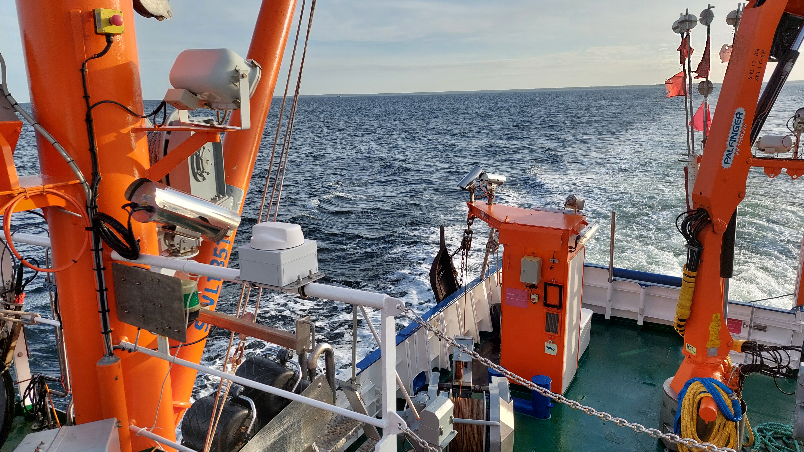

# Deckbox

The deckbox enables geo-referencing of measurements, data trafficing and data storage. Its main features based on a Rasperry Pi and a router are:
- Mobile connectivity
- Local wireless network
- MQTT broker
- NTP Server
- Timeseries database

The figure below shows a deckbox on a vessel

 

To build and configure a deckbox follow the instructions in the following chaperts:
1. **Hardware:** Desription of the mechanic and electric hardware with a list of all needed parts.
2. **Software:** Desrcition of the software setup.