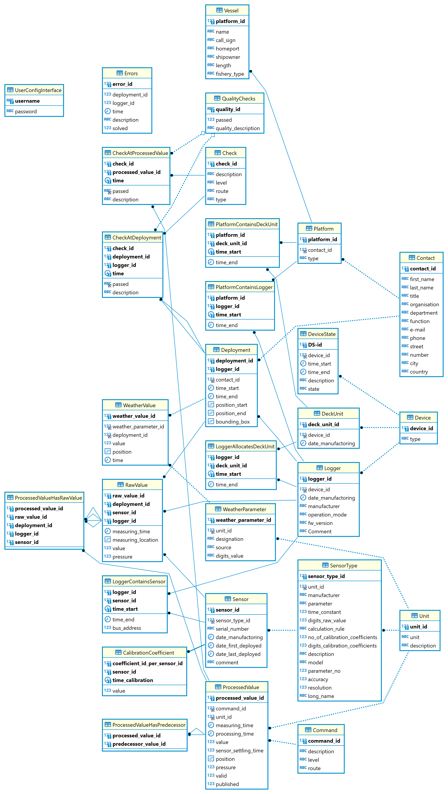

# HyFiVe Server - Relation Database

All information on sensors, loggers, deckunits, ships and measured data are stored in the MariaDB.

## Entity-Relational-Diagram

The structure of a relational database is defined by it's Entity-Relationship-Model. The ER model of our database is depicted below and exported incl. some dummy data in [dump-hyfivedb-202408051002.sql](./dump-hyfivedb-202408051002.sql).

During development of the ER model, we aimed to store:
- all measurement data, incl. raw and processed values
	- Examples: An analog sensor gives a voltage, which can be calculated with a formula and calibration coefficient to turbidity in NTU. In this case we would save the raw (voltage) and calculated value. It is possible to link several calculated values to one raw value, for example if you get better calibration coefficients later. 
- sufficient meta data, to comprehend a measurement even after long time
	- Examples: What was used? Which sensors, Which calibration coefficients, Which deckbox, which vessel, ...
- data, needed to operate a fleet of systems
	- Examples: Contact information of fishermen deploying our system, owner of a specific sensor, date of last calibration, ...

The above aspirations led to the complexity of the ER model. 

## Installation

Installation of the mariadb-server
```
	sudo apt install mariadb-server
	sudo mysql_secure_installation
```
Create administrative user
```
	sudo mariadb
	mariaDB [(none)]> GRANT ALL ON *.* TO 'admin'@'localhost' IDENTIFIED BY 'password' WITH GRANT OPTION;
	mariaDB [(none)]> FLUSH PRIVILEGES;
	mariaDB [(none)]> exit
```
Load the dump file dump-hyfivedb-202408051002.sql. The file contains the structure of the database and two deployments. It also shows how sensors, loggers, ships and other meta information can be inserted.
```
	sudo mariadb
	mariadb --user admin_restore --password < dump.sql
```

<figure> 
   

   <figurecaption><a name="figure1">*Figure 1:*</a> *Entity-Relational model of the HyFiVe data base*</figurecaption>
</figure>


## Backups

To have regular backups of the data a ```mariaDB_backup``` folder in the home directory of the user is created with the subfolders ```backup``` and ```backup_long```. The ```mariaDB_backup``` has a create_backup.sh file 
with a mariadb-dump statement. It copies the database and its content to a file with the current date formatted in yyyy-mm-dd_backup.sql to the folder ```backup```. The find command after delets all files older than 30 days. 
The last section saves the backup into ```backup_long``` on every first of a month. These will not be deleted

```
#!/bin/bash

message=/home/hyfiveuser/mariaDB_backup/backup/$(date +%Y-%m-%d)_backup.sql
#echo "$message"
mariadb-dump --databases hyFiveDB --user="admin" --password="tfZwSRanFaAZ" > "$message"

find /home/hyfiveuser/mariaDB_backup/backup/ -name "*.sql" -type f -mtime +30 -delete

dayOfMonth=`date '+%d'`
if [ $dayOfMonth == 01 ]
then
message=/home/hyfiveuser/mariaDB_backup/backup_long/$(date +%Y-%m-%d)_backup.sql
mariadb-dump --databases hyFiveDB --user="admin" --password="tfZwSRanFaAZ" > "$message"
fi

```

This bash file is called by the crojob once per day by
```
0 1 * * * /home/user/mariaDB_backup/create_backup.sh
``` 

For physical redundancy it is not recomended to only have a backup on one server. Therefore, this procedure should be run on a second server including the --host option refering to the server with the database.
