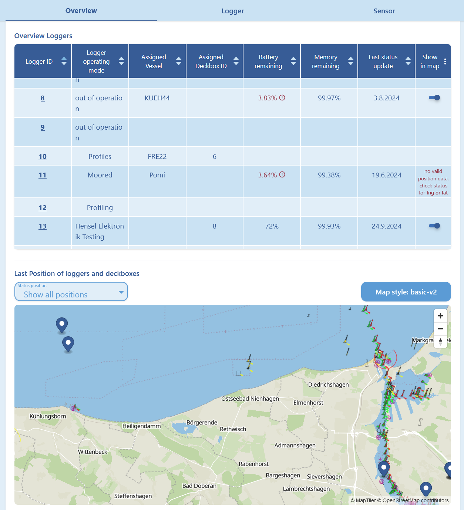

# HyFiVe Server - Webinterfaces

We engaged a external software company to develop two interface. 

The source code for the interfaces is published in the subfolders, incl. instructions on how to install.

## Configuration Interface

Detailed information about config parameters and data transmission can be found in [bi_directional_communication](../../bi_directional_communication/).

The [configuration interface](./config_interface/) has the following functionalities: 
- Gives an overview of all loggers:
    - Currently assigned deck box and vessel
    - Status information
        - Battery remaining
        - Memory remaining
    - Last position shown on map
- Change config parameters of loggers:
    - including sensor information
    - Creating new config files
    - Also writing changes in relational data base
- Create new loggers and sensors 

The configuration interface has to interact with "two points of truth": The database and the existing config files on the server. Part of the config parameters are stored in both; some parameters are only stored in the config files. Although this complicated development, the interface reads all parameters from both sources and writes changes into both correctly. 

## Visualisation interface

The [visualisation interface](./visualisation_interface/) is reachable under [http://hyfive.info:4001](http://hyfive.info:4001) has the following functionalities:
- Visualising all measurement data in the HyFiVe database
- Giving an overview of measurements
    - Filter date, region and vessel
    - Show all corresponding measurements in a table with important meta information
    - Show all corresponding measurements on a map
- Show details of one specific measurement
    - Meta information
    - Plotting parameters over time
    - Plotting parameters over depth
    - Automated cast detection: Divides profiles (plot with parameter over depth) into three segments (downcast, upcast, rest). this is especially valuable for data measured on a trawl net.
    - Show whole track on a map
    - Intelligent zoom function, export function for plots

The visualisation interface interacts with the database by SQL requests to receive the needed measurement and meta data. 

## Pictures of Interfaces

<figure> 
   

   <figurecaption><a name="figure1">*Figure 1:*</a> *Config interface - Overview*</figurecaption>
</figure>

<figure> 
   

   <figurecaption><a name="figure2">*Figure 2:*</a> *Config interface - Logger*</figurecaption>
</figure>

<figure> 
   

   <figurecaption><a name="figure3">*Figure 3:*</a> *Config interface - Sensor*</figurecaption>
</figure>

---

<figure> 
   

   <figurecaption><a name="figure4">*Figure 4:*</a> *Visualisation interface - Overview*</figurecaption>
</figure>

<figure> 
   

   <figurecaption><a name="figure5">*Figure 5:*</a> *Visualisation interface - Plots Part 1*</figurecaption>
</figure>

<figure> 
   

   <figurecaption><a name="figure6">*Figure 6:*</a> *Visualisation interface - Plots Part 2*</figurecaption>
</figure>
