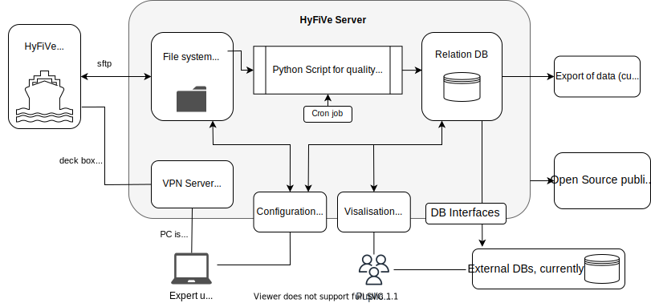

# HyFiVe Server

The server is rented and runs Linux. It has the following functionalities: 
- Receiving all measurement data from the deck boxes as netcdf files via sftp, see [general server setup](./01_Server_setup/).
- [Python scripts](./03_Python/) triggered with cron job, for quality checking the measurement data and transferring it to the data base. Incl. logging check violations.
- Hosting a [relational data base](./02_Database/) for storing all data (measurement data + meta information + data for operating the systems)
- Providing a [configuration webinterface](./04_Webinterfaces/) for expert users to create new config files for of loggers.
- Providing a [visualisation webinterface](./04_Webinterfaces/) for everyone to show HyFiVe measuring data, reachable under [http://hyfive.info:4001](http://hyfive.info:4001). 
- VPN server for remote service of deck boxes, see [general server setup](./01_Server_setup/)
- File storage for backing up measurement (netcdf), config and status files and back up  
- Hosting website [hyfive.info](https://hyfive.info)
- Email server: info@hyfive.info is forwarded to expert users

---

<figure> 
   

   <figurecaption><a name="figure1">*Figure 1:*</a> *Data flow and functionalities of HyFiVe server, for whole system see [bi_directional_communication](../bi_directional_communication/)*</figurecaption>
</figure>

