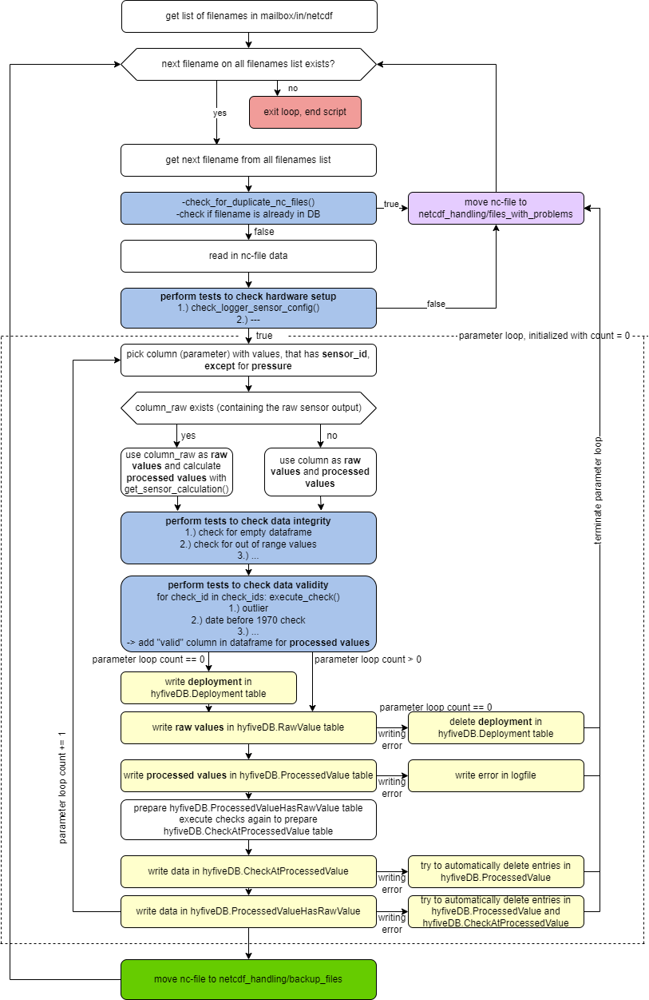

Server Setup
====

# Linux Server
The server is a virtual machine running Ubuntu 20.04.6 LTS with 4 CPU cores and 8 GB of RAM

## SFTP Server
The SFTP server is used to transfer data between the server and the deck boxes. Therefore a own group is created and the server is installed

```
	sudo addgroup sftprestricted
	sudo apt-get install openssh-server  openssh-sftp-server
```

Configure SFTP Chroot Jail in SFTP Chroot Jail in /etc/ssh/sshd_config:
```
	Match Group sftprestricted
		ChrootDirectory %h
		ForceCommand internal-sftp
		PasswordAuthentication yes
		PubkeyAuthentication yes
		PermitTunnel no
		AllowAgentForwarding no
		AllowTcpForwarding no
		X11Forwarding no
```

## Users

Next to the admin two users are needed for the full functionality of the overall system:

1. mainuser: This user runs all operations on the server, creates all folders and runs the cronjobs
	
	add with ```sudo adduser hyfiveuser```.
	
2. loggermailbox: This user is created for the exchange of files by deck boxes in the field. It has limited access to a mailbox folder which should be created before.
	Within the home directory of the mainuser a folder mailbox is created with the follwoing structure
	```
	mailbox/
		in/
			netcdf/
			status/
		out/
			config/
	```

	A link of this folder is created for the loggermailbox
	```
		ln -s /opt/HyFiVe/mailbox/in/ mailbox
	```
	
	Add the user with
	```
		sudo adduser --no-create-home loggermailbox
		sudo usermod -d /home/hyfiveuser/datain loggermailbox
		sudo usermod -d /opt/HyFiVe/mailbox loggermailbox
		sudo usermod -s /sbin/nologin loggermailbox
		sudo usermod -g sftprestricted loggermailbox
	```

## OpenVPN Server
The OpenVPN server is installed by the admin as follows
```
	sudo apt install openvpn easy-rsa
	sudo make-cadir /etc/openvpn/easy-rsa
	cd /etc/openvpn/easy-rsa 
	./easyrsa init-pki
	./easyrsa build-ca
```
Create Diffie Hellman parameter, a certificat for the OpenVPN server and copie all certificats and keys to /etc/openvpn/
```
	./easyrsa gen-dh
	./easyrsa sign-req server myservername
	cp pki/dh.pem pki/ca.crt pki/issued/myservername.crt pki/private/myservername.key /etc/openvpn/
```
Create certificats and keys for deck boxes
```
	cd ~/openvpn
	/usr/share/easy-rsa/easyrsa gen-req DeckboxXY nopass
	/usr/share/easy-rsa/easyrsa sign-req client DeckboxXY
	cd pki
	zip -j DeckboxXY.zip ./issued/DeckboxXY.crt ./private/DeckboxXY.key ca.crt
```
Modify further settings
```
	sudo cp /usr/share/doc/openvpn/examples/sample-config-files/server.conf.gz /etc/openvpn/myserver.conf.gz
	sudo gzip -d /etc/openvpn/myserver.conf.gz
	ca ca.crt
	cert myservername.crt
	key myservername.key
	dh dh2048.pem
```
Create a ta.key
```
	cd /etc/openvpn
	sudo openvpn --genkey --secret ta.key
```
Umcomment the line ```#net.ipv4.ip_forward=1``` in ```/etc/sysctl.conf``` for IP forwarding and reboot sysctl
```
	sudo sysctl -p /etc/sysctl.conf
```

## Interfaces
The configuration and visualisation interface are installed to the server according to the readmes in the folders Interfaces/ .

# MariaDB

All information on sensors, loggers, deckunits, ships and measured data are stored in the MariaDB.

## Installation

Installation of the mariadb-server
```
	sudo apt install mariadb-server
	sudo mysql_secure_installation
```
Create administrative user
```
	sudo mariadb
	mariaDB [(none)]> GRANT ALL ON *.* TO 'admin'@'localhost' IDENTIFIED BY 'password' WITH GRANT OPTION;
	mariaDB [(none)]> FLUSH PRIVILEGES;
	mariaDB [(none)]> exit
```
Load the dump file dump-hyfivedb-202408051002.sql. The file contains the structure of the database and two deployments. It also shows how sensors, loggers, ships and other meta information can be inserted.
```
	sudo mariadb
	mariadb --user admin_restore --password < dump.sql
```

## Data handling (internal)

### Measured data

Measured data arrives on the server in .nc files. For processing it there is a ```netcdf_handling``` folder in the main directory of the user structured as:
```
netcdf_handling/
	backup_files/
	files_with_problems/
	logs/
		yyyy-mm-dd.txt
	python_scripts/
		checks_list.py 
		classes_writeToDB.py
		functions_writeToDB.py
		main_writeToDB.py
		processing_rules.pkl
		
```

All of the above mentioned scripts are located in the subfolder Python/ of this readme. Incoming data is processed by ```main_writeToDB.py``` which is called by the cronjob every 15 minutes
```*/15 * * * * python3 /home/hyfiveuser/netcdf_handling/python_scripts/main_writeToDB.py > /dev/null 2>&1```

main_writeToDB.py uses functions_writeToDB.py, classes_writeToDB.py (for locations; points/polygons), checks_list.py for check specifications, processing_rules.pkl for parameter specific validity criteria.

An overview of the routine run by the script is given below.

<figure> 
   

   <figurecaption><a name="figure1">*Figure 1:*</a> *Flowchart*</figurecaption>
</figure>

Notes for processed/raw values by the Python script:
1. **ADC value or any value that must be processed with calibration coefficients:** The value is stored in RawValue and the corresponding calibration coefficients form table CalibrationCoefficient in combination with
the calucation_rule in SensorType are used to calculate the processed value for table ProcessedValue in the next step. This makes it possible to trace the processed value back to the sensors reading (used for the 
TSYS01 by BlueRobotics). The calculation rule must be given in the form of ```f0 * c0 * val ** p0 + ... + fn * cn * val ** pn``` with fx being factors, cx being calibration coefficients and px being the power. The 
preparation of the calculation is done in the function ```get_sensor_caluclation(sensor_id, engine, time_end_deployment)```. For a smooth way of this function to run insert the fx and px to the SensorType as follows:
'[f0, f1, ..., fn], [p0, p1, ..., pn]'
2. **Pre-processed value**: Some sensors do not give a raw value with calibration coefficients and a calculation rule to handle the raw value. In this case the reading of the value from the sensor is as raw as it gets.
Therefore the value is stored in RawValue and Processed value without any math inbetween. Of course there is always the option of calibration the sensor in a lab and think of an own calculation rule to process the
read out value as raw value.

To distinguish the two above mentioned cases, the script checks for the existence of a dataframe column named "parameter_raw", e.g. "temperature_raw" in addition to the "temperature" column. If the "parameter_raw" column exists, it contains the ADC value from case 1. Else the values in "parameter" will be used and case 2 applies.

-checks if time input is an iso-string (happened a couple of times in the first nc files), then uses parser to convert this string to a datetime.datetime object. This will be obsolete in the future hopefully.
-checks if dataframe is empty.

-checks for out of range values (from the point of possible database entries, -1e12 < x <= 1e13) and sets those values to -9999.
-executes data validity checks (criteria from processing_rules.pkl), to be able to write the "valid" column of the ProcessedValue table later as whole dataframe (more time efficient than updating every single ProcessedValue entry made one by one) 
-formats entries for deployment table and writes deployment table; 
-writes raw value data; deletes deployment entries, if error occurs while writing rawvalue table for the first sensor;
-prepares and writes processed values in ProcessedValues table
-executes validity checks again, prepares and writes corresponding executed checks in CheckAtProcessedValue table
-prepares and writes ProcessedValueHasRawValue table for connection of processed and raw values.

-if successfully written in db, copys nc file to backup folder and deletes old one.
-if problems occured while writing, the nc file gets copied to files_with_problems folder and the old file is deleted.

if some unexpected error occured, the console error message is written in the log file.

#### checks_list.py and adding a check

checks_list.py contains all validity checks in the main function execute_check(). So far this is a check for outliers and a check for realistic dates (data before 1970 does not pass the test). The validity criteria come from processing_rules.pkl, a pickled file that is created and modified by processing_rules.py. More checks can be implemented by adding another elif loop in checks_list.py/execute_check() with a check_id. This check_id has also to be added in the database in the hyfiveDB.Check table. To exectue the check, the check_id has to be added to the check_ids in the processing_rules.pkl, in the dictionary ['general']['check_ids'], where the main script gets the ids from.


## Backups

To have regular backups of the data a ```mariaDB_backup``` folder in the home directory of the user is created with the subfolders ```backup``` and ```backup_long```. The ```mariaDB_backup``` has a create_backup.sh file 
with a mariadb-dump statement. It copies the database and its content to a file with the current date formatted in yyyy-mm-dd_backup.sql to the folder ```backup```. The find command after delets all files older than 30 days. 
The last section saves the backup into ```backup_long``` on every first of a month. These will not be deleted

```
#!/bin/bash

message=/home/hyfiveuser/mariaDB_backup/backup/$(date +%Y-%m-%d)_backup.sql
#echo "$message"
mariadb-dump --databases hyFiveDB --user="admin" --password="tfZwSRanFaAZ" > "$message"

find /home/hyfiveuser/mariaDB_backup/backup/ -name "*.sql" -type f -mtime +30 -delete

dayOfMonth=`date '+%d'`
if [ $dayOfMonth == 01 ]
then
message=/home/hyfiveuser/mariaDB_backup/backup_long/$(date +%Y-%m-%d)_backup.sql
mariadb-dump --databases hyFiveDB --user="admin" --password="tfZwSRanFaAZ" > "$message"
fi

```

This bash file is called by the crojob once per day by
```
0 1 * * * /home/user/mariaDB_backup/create_backup.sh
``` 

For physical redundancy it is not recomended to only have a backup on one server. Therefore, this procedure should be run on a second server including the --host option refering to the server with the database.
