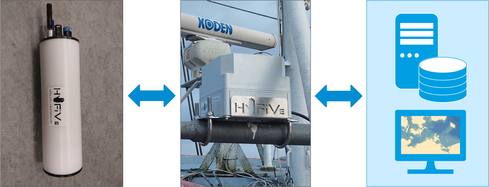

# HyFiVe - Hydrography on Fishing Vessels

---
---

## Project Background 
Whether for modelling climate change or for our understanding of fish stocks – ocean data is essential for many disciplines. Usually, this data is collected by research vessels, which are cost-intensive and thus limited in space and time. To increase data resolution ‘vessels of opportunity’ can be a scalable alternative. In this concept vessels are used as measuring platforms, that are originally financed for a non-scientific purpose. Especially fishing vessels are of interest as they deploy gear in deep water and so make the whole water column accessible for an attached measuring system.

For this use case we developed a very flexible autonomous measuring system, which can be deployed on fishing gear to collect data in an affordable and scalable way. This was done within the **project ‘Hydrography on Fishing Vessels - HyFiVe’**
- Project period: Sept 2021 until Sept 2024
- Project partners:  
    - Thünen-Institute of Baltic Sea Fisheries (TIOF), Rostock, Germany, [www.thuenen.de/en/institutes/baltic-sea-fisheries](www.thuenen.de/en/institutes/baltic-sea-fisheries)
    - Leibnitz-Institute for Baltic Sea Research Warnemünde (IOW), Germany [www.thuenen.de/en/institutes/baltic-sea-fisheries](www.io-warnemuende.de)
    - Hensel Elektronik GmbH, Rostock, Germany [www.hensel-elektronik.de](www.hensel-elektronik.de)
- Project webpage: hyfive.info
- Contact: See hyfive.info

## The HyFiVe System

This measuring system essentially consists of three components: 
1. Logger: Measures data with implemented OEM sensors while in the water and transmits them wireless afterwards.
2. Deck box: Receives measuring data via wifi, geo-references and stores it, visualises it locally via webservice and transmits it to shore. The deck box also forwards config updates from server to loggers.
3. Land-Based Server: Central infrastructure with a relational database, a configuration interface for remote maintenance and a tool for visualisation of measuring data.

The HyFiVe system offers many advantages:
- Autonomous operation up to several month
- Usable for non-experts, robust design
- Affordable price 
- Near live transmission of geo-referenced data to shore
- Scalability: Designed for a growing fleet of loggers and deck boxes
- Flexibility: Tested in various use cases, e.g. on trawl nets, as handheld probe and on sailing vessels 
- Modular design of logger facilitating easy change of sensors and integration of new ones
- Bi-directional data flow offering possibilities for remote servicing (VPN to deck box, config.json file for logger) 
- Comprehensive meta data
- Use of open sub-components and open standards lowering costs and facilitating reuse (e.g. ESP32, Raspberry Pi, nodeRed, InfluxDB, netcdf, https://cfconventions.org/ for naming variables)
- Open source, so you can modify and commercialise (according to the licenses below)

<figure> 
   

   <figurecaption><a name="figure1">*Figure 1:*</a> *Logger (left), deck box (middle) and server (right) - the three components of the HyFiVe measuring system*</figurecaption>
</figure>

## Github Repository
This project enables you to build you own HyFiVe system with detailed instructions on how to setup all parts. 

If you are interested in building a system and lack information, please get in contact with us. 

The three components have separate folders with hardware, software and specific information including READMEs which can be followed step by step. The READMEs contain
- Purpose and short description
- Used tools (hardware and software)
- Bills of Materials
- Additional information in the making/deploying

## Licenses
HyFiVe is an open-source project consisting of software, hardware, and documentation components. Each part of this project is licensed under a different copyleft license to ensure it remains free and open:

- Software/Code is licensed under [MPL-2.0](LICENSE_MPL-2.0)
- Hardware is licensed under [CERN-OHL-W-2.0 or later](LICENSE_CERN-OHL-W-2.0)
- Documentation is licensed under [CC-BY-SA-4.0](LICENSE_CC-BY-SA-4.0)

The HyFiVe logo is not published under above licenses and not free to use. 
