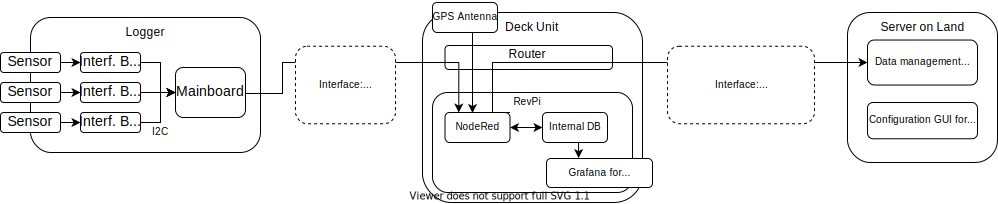

# Bi-directional Communication between Server and Logger

## Data Flow from Logger to Server

<figure> 
   

   <figurecaption><a name="figure1">*Figure 1:*</a> *Data flow from logger to land*</figurecaption>
</figure>

The following data flow on the server is described in [../03_Server](../03_Server/Readme.md)

This flow consists mainly of **measuring data**:
1. After a deployment, the logger tries to connect with the Wifi and send the data via MQTT
2. On the deck box in  NodeRED the data is merged with buffered GPS info and saved locally to the Influx database.
3. In regular intervals NodeRED triggers a python script, which aggregates new deployments into netCDF files, and sends them via sftp to the server (mailbox/in/netcdf/logger_ID/).
4. On the server, the measuring data is quality checked and saved in the relational data base
5. The measuring data is forwarded to other data bases via interfaces and can be visualised on our own [web interface](../03_Server/04_Webinterfaces/readme.md) under hyfive.info:4001

In addition each logger sends **status information**:
1. Each logger sends in regular intervals (which is a config parameter) it's battery and memory status via Wifi/MQTT.
2. On the deck box in NodeRED this information is merged with the current position of the deck box and saved as a status.json file
3. This file is sent via mobile network and sftp to the server (mailbox/in/status/logger_ID/). Example file: [logger_17_status_1724931613709.json](./logger_17_status_1724931613709.json)
4. The information is shown in the config [interface](../03_Server/04_Webinterfaces/readme.md).

## Data Flow from Server to Logger

<figure> 
   

   <figurecaption><a name="figure2">*Figure 2:*</a> *Data flow from land to logger*</figurecaption>
</figure>

An aim of the HyFiVe project is, that a fleet of measuring systems can be managed with small effort. Therefore we developed a ways of remote servicing.

A comprehensive way for remote servicing the deck box, is to connect to it via VPN. The expert user onshore can configure both main components, the router (via it's webinterface) and Raspberry Pi (via SSH). Also all software interfaces like NodeRED and InfluxDB can be reached via port forwarding. 

For changing the configuration of loggers, which are already deployed on a remote vessel, we defined a set of config parameters, which are stored in a config.json file.

The **config files** can be created with an [web interface](../03_Server/04_Webinterfaces/readme.md) on the server and handed down from server to loggers:
1. Creation:  
After creation by the webinterface, the config files are stored on the server:
    - location: mailbox/out/config/logger_ID/
    - file name: logger_ID_config_DATE, with DATE like YYYYMMDDHHMM, e.g. logger_10_config_202405071357
The format of the file name is important and shall not be altered, as the ID in the file name is used to them assign to the right logger and the date is used to identify the latest file. 
2. Transmission from server to deck box:   
Each deck box copies all config files from the server to a local repository. This is done in regular intervals by a flow in NodeRED on the deck box. 
3. Transmission from deck box to logger:  
As a deck box does not know which loggers are close and also has no way (implemented) to start a MQTT connection, the loggers need to ask for updates. They do this in regular intervals given by the config parameter config_update_periode. The process is described in detail below. 

More info on config parameters and their transmission is given in [./01_config_update/README.md](./01_config_update/README.md).